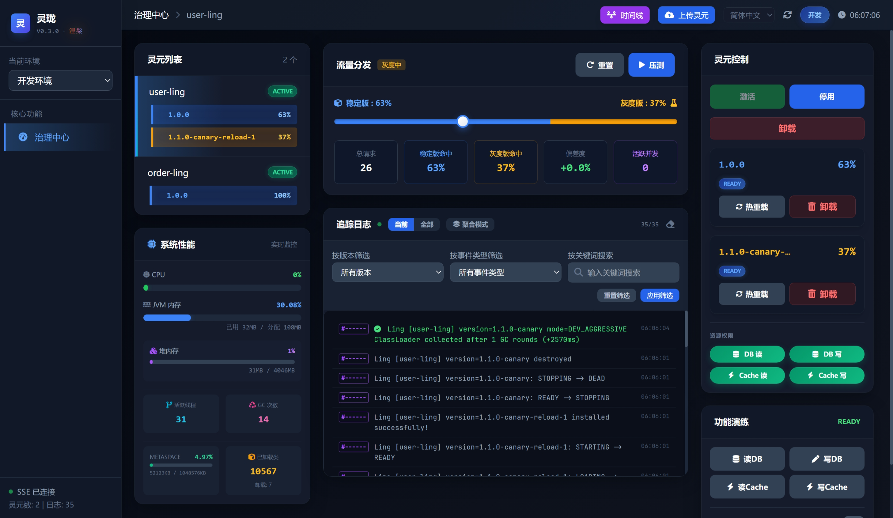

<h1 align="center">灵珑 · LingFrame</h1>

<p align="center">
  <strong>让长期运行的 JVM 系统，也能安全地持续演进。</strong>
</p>

<p align="center">
  
  
  
  
  
</p>

<p align="center">
  <a href="https://gitee.com/LingFrame/LingFrame">
    
  </a>
  <a href="https://atomgit.com/lingframe/LingFrame">
    
  </a>
  <a href="https://github.com/LingFrame/LingFrame">
    
  </a>
  <a href="https://deepwiki.com/LingFrame/LingFrame">
    
  </a>
</p>

<p align="center">
  <a href="https://dashboard.lingframe.cn" target="_blank">
    
  </a>
</p>

<p align="center">
  <strong>中文</strong> | <a href="./README.en.md">English</a>
</p>

系统运行久了，业务不停迭代，代码越来越庞大，结果谁也不敢轻易改动。

灵珑是一个面向长期运行系统的 **JVM 运行时治理框架**。它让你在系统运行期间，把新功能或老模块隔离成独立的**灵元**（Ling——可独立加载、运行、治理与卸载的业务单元），而不必为了每一次演进重新打包部署整个系统。

它不决定你的系统拆成几个服务，它解决的是每个 JVM 进程内部如何持续演进。**它可以在系统生命周期的任何阶段介入**——不需要立刻推翻重构，也不用急着拆微服务。

定位示意图（灵珑在系统架构中的层级）：

```text
               系统架构维度（进程间划分）
     单体         模块化单体        微服务
       │               │              │
       └───────────────┼──────────────┘
                       ▼
               任何 JVM 进程内部
                       │
                 灵珑运行时治理
                       │
             ┌─────────┼─────────┐
             ▼         ▼         ▼
           灵元 A    灵元 B    灵元 C
             │         │         │
           路由 · 灰度 · 隔离 · 卸载
```

---

## 怎么用它解决问题：先试，再看，后收

在实际业务中，最怕上线后出事故。灵珑推荐一种渐进式的改造方式：

```text
老实现（留在灵核——即你的主应用进程 / 或已有灵元 v1）  ──继续扛流量──►
                                                                  │
           新功能写成 灵元 v2（尽量不动老代码）  ──权重/灰度切入──►  观察
                                                                  │
                           数据/体验/故障面 OK？ ──┬─ 否 → 收回权重 / 卸载 v2
                                                 └─ 是 → 再决定老路径瘦身或下线
```

要点：

| 步骤 | 含义 |
| --- | --- |
| 老代码先不动 | 改造成本不前置；不强求“先重构干净才能上线” |
| 新功能写成新灵元 | 变更落在独立新边界上，不在旧堆上继续叠代码 |
| 双版本并行 | 在同一个进程里并行跑，不是蓝绿部署整进程二选一 |
| 切流量看信号 | 用权重路由少放一点流量进来看日志，不把状态当开关 |
| 稳定后再收尾 | 下线旧路径是确认无误后的决定，不是上线的前置条件 |

### 为什么这样更安全

* **发布更独立**：快节奏和慢节奏的功能不用硬绑在一起发布。新版本可以单独安装、单独切流、单独卸载。
* **上线不靠赌**：不必在信息不全时做“全量替换”的大爆炸迁移。先并存、多观察，用证据说话，退路随时都在。
* **收敛更从容**：老路径是否下线，不需要在发布当天决定，而是在验证充分之后自然完成。

---

## 你能得到什么

| 能力 | 是什么 | 解决什么问题 |
| --- | --- | --- |
| 进程内隔离 | 单 JVM 内灵元类型隔离（非“绝对静态隔离”） | 同进程里灵元之间不撞 Class，老代码不被新代码带飞 |
| 规范装卸 | 有序生命周期；卸载目标是 **classloader 可证 GC** | 装得上、卸得下，卸完能确保内存资源真能收回来 |
| 多版本与灰度 | 多版本并行；用**流量权重**逐步放量 | 新版本不靠停机切换；流量切错了能随时收回 |
| 调用治理 | 限流、舱壁、超时、权限、审计等统一策略 | 治理逻辑走同一条拦截主链，不用各个接口重复写 |
| 控制面 | Dashboard：生命周期、灰度、模拟、实时信号 | 随时可视化查看真实运行状态并进行人工干预 |
| 双层状态模型 | 实例事实 vs 运行时聚合，写权限严格分离 | 状态谁能写清清楚楚，并发场景下不会乱改状态 |
| 双 Spring 栈 | **默认** Spring Boot 2.7 + JDK 8 · **支持线** Boot 3.5 + JDK 17 | 不用为了升 Boot 3 重构整个框架，两条栈都支持 |

### 运行时架构

```text
┌────────────────────────────── 灵核（你的主应用进程） ──────────────────────────┐
│  Shared API（进程级公共契约 — 加载后冻结；已进入共享边界的契约不支持热更新/热卸载）    │
│                                                                              │
│   ┌──────────┐   治理主链：路由 · 守卫 · 灰度 · 韧性 · 权限 · …             │
│   │ Dashboard│ ─────────────────────────────────────────────────────────────►│
│   └──────────┘                         │                                     │
│                                        ▼                                     │
│              ┌──────── 灵元 A v1 ──────┐   ┌──── 灵元 A v1.1-canary ────┐    │
│              │  LingClassLoader（子）  │   │  LingClassLoader（子）     │    │
│              └─────────────────────────┘   └────────────────────────────┘    │
│                                                                              │
│   实例层 = 某个版本的真实生命周期                                            │
│   运行时层 = 某个灵元 id 的宏观呈现                                          │
└──────────────────────────────────────────────────────────────────────────────┘
```

设计立场：[WHY.md](WHY.md) · [MANIFESTO.md](MANIFESTO.md)

---

## 最短跑通

- **方式一：在线体验（零门槛）**
  直接访问 [灵珑 Live Demo](https://dashboard.lingframe.cn)，即可在线操作 Dashboard 体验灵元治理与切流，无需本地环境。
  访问令牌：`lingframe`。

- **方式二：本地跑通（开发评估）**
  需要 JDK（**示例默认 8**；支持线可用 17）与 Maven。

```powershell
mvn -pl lingframe-examples/lingframe-example-lingcore-app -am package -DskipTests
cd lingframe-examples/lingframe-example-lingcore-app
mvn spring-boot:run
```

- 应用：`http://localhost:8888`  
- Dashboard：`http://localhost:8888/dashboard.html`  

```powershell
curl http://localhost:8888/lingframe/dashboard/lings
curl http://localhost:8888/user-ling/user/listUsers
```

命令细节：[QUICK_START.md](QUICK_START.md)

跑起来后建议：

1. 打开 Dashboard，确认示例灵元已加载  
2. 再打一笔业务请求，确认链路可达  
3. 看监控 / 治理页是否有真实信号  
4. 多版本时用流量权重放量，不要用运行时状态代替切流  

### Dashboard 预览

[](https://dashboard.lingframe.cn)

> 点击截图即可进入在线体验；线上环境已内置示例灵元，支持实时查看生命周期、路由切流与模拟演练。

示例两条路径（总览见 [lingframe-examples/zh-CN/README.md](lingframe-examples/zh-CN/README.md)）：

| 路径 | 入口 |
| --- | --- |
| 入门用法 | `lingframe-example-lingcore-app` + user / order |
| 商城演进示例 | `ling-mall` → `saas-mall` |

---

## 它适合什么，不适合什么

### 最适合

- 已经运行多年、不能轻易停机或重写的单体系统；
- 希望逐步引入隔离、灰度、限流、熔断、权限与审计的团队；
- 想在不彻底推翻现有系统的前提下，先在进程内建立运行秩序。

### 也适用于

- **新项目**：希望从第一天开始就按“灵元”划清业务边界，避免未来演变为无法维护的泥潭；
- **庞大的微服务内部**：微服务内部代码膨胀为“分布式单体”时，在服务进程内部建立演进边界；
- 需要按不同迭代节奏独立发布和治理多模块的系统。

### 不适合

- **把它当成微服务替代品**：灵珑管的是服务内部代码的演进，不管跨服务网络通信。两者是互补关系而非替代关系；
- 把它当成纯前端插件市场或低代码装配平台；
- 希望接入一个框架就自动消除业务复杂性。

### 和常见路径的差别

| 常见路径 | 往往卡在哪 | 灵珑侧重 |
| --- | --- | --- |
| 自研类加载 / 父子容器 | 能装，难管、难卸、难看清 | 装卸、统一治理、控制台 |
| 通用插件框架 | 模块化有了，长期运行治理要自己补 | 面向长期运行的管控与卸载 |
| 直接拆微服务 | 隔离彻底，成本与风险都高 | 还不能拆时，先在进程内重建边界 |
| 只靠网关灰度 | 入口能切流，进程内仍是一锅粥 | 进程内多版本、调用治理、可观察、可回收 |

### 设计边界与当前限制

- 当前公开能力集中在**单进程内**的灵元隔离与治理；
- Shared API 是进程公共契约：新包可以预加载，但**已进入共享边界的契约不支持热更新或热卸载**（这是保证类型安全的架构设计取舍，破坏性变更仍需重启进程）；
- 存储治理主要覆盖 Spring 注入的 `DataSource`，手写的原生 JDBC 连接无法拦截；
- 危险 API 扫描是加载阶段的提醒信号，并不是 JVM 级别的完整安全沙箱；
- 验证主路径为 **Spring Boot 2.7 + JDK 8**（示例默认）；Spring Boot 3 + JDK 17 为支持线；
- **0.4.0 版本仍处于 Pre-1.0 阶段**：建议上线前先在测试环境充分评估，并对照 [生产配置清单](docs/zh-CN/production-hardening.md) 进行核验。

---

## 最小接入（接到自己的灵核）

构件以本仓库为准（若无私服，请先本地安装）：

```powershell
mvn -pl lingframe-bom,lingframe-runtime/lingframe-spring-boot2-starter,lingframe-dashboard -am install -DskipTests
```

**Spring Boot 2.7 / JDK 8（默认路径）：**

```xml
<dependencyManagement>
  <dependencies>
    <dependency>
      <groupId>com.lingframe</groupId>
      <artifactId>lingframe-bom</artifactId>
      <version>0.4.0</version>
      <type>pom</type>
      <scope>import</scope>
    </dependency>
  </dependencies>
</dependencyManagement>

<dependencies>
  <dependency>
    <groupId>com.lingframe</groupId>
    <artifactId>lingframe-spring-boot2-starter</artifactId>
  </dependency>
  <!-- 可选控制面 -->
  <dependency>
    <groupId>com.lingframe</groupId>
    <artifactId>lingframe-dashboard</artifactId>
  </dependency>
</dependencies>
```

若走 **Spring Boot 3 / JDK 17**，改为 `lingframe-spring-boot3-starter`（本仓库构建请加 `-Pspring-boot3`）。

**灵核 `application.yml`（骨架）：**

```yaml
lingframe:
  enabled: true
  dev-mode: true          # 仅本地；生产务必关闭
  ling-home: "lings"      # 已打包灵元目录
  # preload-api-jars: [ "path/to/shared-api" ]
```

### 选配 Dashboard

引入 `lingframe-dashboard` 依赖后，必须显式设置 `lingframe.dashboard.enabled: true` 才会装配控制面。最小可运行配置：

```yaml
lingframe:
  dashboard:
    enabled: true
    access-token:
      enabled: true
      token: "${LINGFRAME_DASHBOARD_TOKEN}"   # 生产必填，留空启动失败（fail-closed）
    storage:
      path: "/var/lib/lingframe/dashboard.db" # SQLite 持久化；生产指向独立可写目录
```

全量配置项与逐项说明：[`application-prod.yaml.example`](lingframe-examples/lingframe-example-lingcore-app/src/main/resources/application-prod.yaml.example) · 生产硬化清单：[`docs/zh-CN/production-hardening.md`](docs/zh-CN/production-hardening.md)。

**灵元 `ling.yml`（骨架）：**

```yaml
id: user-ling
version: 1.0.0
mainClass: "com.example.UserLing"
```

完整从零：[docs/zh-CN/getting-started.md](docs/zh-CN/getting-started.md) · 写灵元：[docs/zh-CN/ling-development.md](docs/zh-CN/ling-development.md) · 上线前：[docs/zh-CN/production-hardening.md](docs/zh-CN/production-hardening.md)

---

## 性能（内核微基准）

大多数业务场景下，SQL、RPC、序列化等开销通常远高于治理链，因此框架本身一般不会成为主要瓶颈。

公开 JMH 样例（空业务体 / 反射终端；**不是**业务 SQL 或 RPC）：  
[`benchmark-results-20260709-044113.txt`](lingframe-benchmark/benchmark-results-20260709-044113.txt)

| 路径 | 单线程约 / 次 | 热路径分配 | 扩展粗看 |
| --- | ---: | ---: | --- |
| 治理链 + 终端调用 | **~19 µs** | ≪ 1 B/op | 1→8 线程吞吐约 **6.8×** |
| 仅治理（业务仍在灵核 Web/AOP） | **~0.8 µs** | ~0 | 1→8 线程吞吐约 **4.1×** |

复现：[`lingframe-benchmark/README.md`](lingframe-benchmark/README.md)。上线请用自己的业务压测。

---

## 继续往下

| 目标 | 文档                                                              |
| --- |-----------------------------------------------------------------|
| 按阶段阅读 | [详细目录](docs/zh-CN/README.md)                                    |
| 集成、写灵元、配置 | [文档地图 · 接入与开发](docs/zh-CN/README.md#接入与开发)                      |
| 生产配置 | [production-hardening](docs/zh-CN/production-hardening.md)      |
| 架构 | [架构设计](docs/zh-CN/architecture.md)                              |
| 本版交付 | [CHANGELOG](CHANGELOG.md)                                       |
| 参与贡献 | [CONTRIBUTING](CONTRIBUTING.md) · [开发手册](DEVELOPMENT_MANUAL.md) |

---

## 致谢

**特别鸣谢 Gitee 官方与开源社区的推荐与支持！**

感谢 [Gitee](https://gitee.com) 平台以及红薯老师为本土开源生态提供的优质土壤，让底层的轮子也能被看见。  

---

[](https://atomgit.com)

本项目是 **AtomGit G-Star 孵化项目**。  
感谢 [AtomGit](https://atomgit.com) 平台对开源项目的支持与推广。
