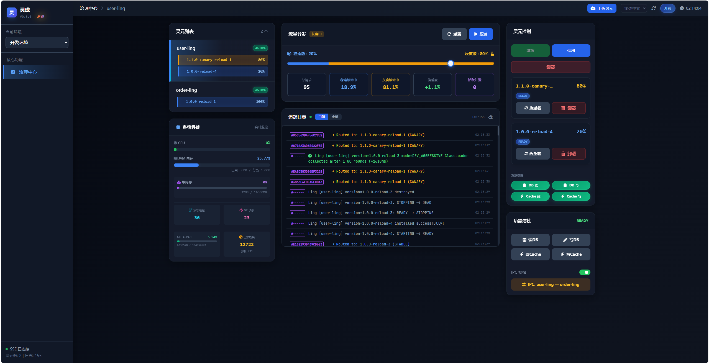

<h1 align="center">灵珑 · LingFrame</h1>

  <strong>面向长期运行系统的 JVM 运行时治理框架</strong>

  
  
  
  
  
  

  
  
  
  
  

  <a href="./README.md">English</a> | <strong>中文</strong>

## 测试入口

- 默认验证集：`mvn test`
- 一次跑完两个示例集成冒烟：
  `mvn -pl lingframe-examples/lingframe-example-lingcore-app -am -Pintegration-check verify`
- 只跑单个集成冒烟时：
  `mvn -pl lingframe-examples/lingframe-example-lingcore-app -am -Pintegration-check verify "-Dit.test=ObservabilityClosedLoopIntegrationTest"`

---

灵珑是一个面向长期运行系统的 **JVM 运行时治理框架**。

它不要求你立刻重写系统，也不强迫你马上拆成微服务。  
它更关心另一件更现实的事：

> 当系统已经运行很多年、不能轻易停下、也越来越难改时，  
> 我们能不能先把它重新变得可理解、可控制、可演进。

很多系统并不是设计得不好。  
只是活得太久，改得太急。

如果只用一句话记住灵珑，可以这样理解：

> 灵珑不只负责把灵元加载进 JVM，  
> 更负责让它们在长期运行中可治理、可收敛、可被干净地卸载出去。

---

## 📖 你可以先从这里开始

- **想先快速跑通**：先看 [QUICK_START.zh-CN.md](./QUICK_START.zh-CN.md)
- **想正式入门**：看 [getting-started.md](docs/zh-CN/getting-started.md)
- **想快速理解它解决什么问题**：看 [practical-entry.md](docs/zh-CN/practical-entry.md)
- **想了解 `0.3.0` 当前架构已经做到哪一步**：看 [technical-entry.md](docs/zh-CN/technical-entry.md)
- **想理解灵珑为什么这样设计**：看 [WHY.md](WHY.md)
- **想理解灵珑坚持什么**：看 [MANIFESTO.md](MANIFESTO.md)

> 你不需要一次读完整套文档。  
> 灵珑允许你在任何阶段停下来，再继续往下看。

---

*当前 Dashboard 已经是实际可用的治理控制面，而不只是展示页面。*

---

## ✨ 灵珑是什么？

灵珑不是把“插件框架”换了一个名字。  
它也不是“单体改造万能药”。

更准确地说，它是：

- 一个面向单进程长期运行系统的运行时治理框架
- 一个帮助老系统重新恢复边界感和控制感的结构化工具
- 一个允许灵元存在，但不接受灵元失控的治理体系

它关心的重点不是再堆一层功能，  
而是把系统里已经存在、但越来越失控的复杂性重新收回来。

---

## 💎 灵珑最独特的地方

- **不只强调热加载，更强调规范热卸载**：灵元不是“能下线就行”，而是要经历排空、清理、资源释放与状态收口
- **把零泄漏热卸载当作正式目标**：不是简单丢掉 `ClassLoader`，而是把卸载清理、资源驱逐、泄漏检测做成长期运行机制
- **把长期运行秩序收敛成一条主链**：调用治理、运行时状态、控制面、监控事件不是散着拼，而是在收束为统一运行时内核
- **对热更新边界保持克制**：像 `Shared API` 这种进程级契约，不拿“不安全但看起来很酷”的热更能力做宣传

---

## 🎯 它适合什么，不适合什么

### 更适合

- 已经运行多年、不能轻易停机或重写的单体系统
- 希望逐步引入灵元隔离、灰度、限流、熔断、权限与审计能力的团队
- 想在不彻底推翻现有系统的前提下，先把运行时秩序建立起来的场景

### 不适合

- 把它当成微服务替代品
- 把它当成纯前端插件市场或低代码装配平台
- 希望接入一个框架就自动消除业务复杂性

灵珑不会替系统做决定。  
它只是尽量把决定重新放回该发生的位置。

---

## 🚀 当前阶段

### 🔹 v0.3.0 · 涅槃

这一阶段的重点，不是继续向外堆分散能力，  
而是把已经存在的治理机制真正收束成一条稳定、可复用、可解释的运行时主链。

当前已经明确交付的核心内容包括：

- 围绕 `InvocationPipelineEngine` 与 `FilterRegistry` 收束统一治理 Pipeline
- 明确三种执行模式：`NORMAL`、`SIMULATION`、`GOVERN_ONLY`
- 让灵元调用、Spring Boot 2 / 3 Web 治理、灵核 Bean 拦截、Dashboard 模拟共用同一条治理内核
- 将运行时状态收束为 `InstanceStatus` 与 `RuntimeStatus` 双层模型，并分别由 `InstanceCoordinator`、`RuntimeCoordinator` 负责状态写入
- 由 `DefaultLingLifecycleEngine` 明确承担部署、重载、卸载的生命周期编排
- 将卸载清理、资源驱逐与泄漏检测正式纳入长期运行职责，朝规范热卸载与零泄漏目标持续收敛
- 让 `SharedApiManager` 明确共享 API 的启动边界：预加载、注册包、冻结边界、再加载灵元
- 让 Dashboard 真正成为治理控制面，提供生命周期操作、灰度配置、治理补丁、模拟、指标和 SSE 事件流

换句话说，灵珑现在已经不只是“机制拼装”，  
而是在往一套真正可长期维护的运行时治理内核收敛。

---

## 🧩 它真正想解决的问题

在真实系统里，问题往往不是功能不够，而是这些情况越来越常见：

- 系统还在跑，但已经没人敢动
- 边界还在名义上存在，实际却越来越模糊
- 灰度、熔断、权限、审计各自有一点，但没有统一的运行时落点
- 重启不是绝对不能接受，不能接受的是不可预期

灵珑真正关心的，其实只有一个问题：

> 系统在长期运行中，如何不失控。

不是靠堆更多规定，  
而是靠更清楚的边界、更稳定的治理主链、更诚实的运行时反馈。

---

## ⚙️ 技术边界

- JVM：JDK 17 / JDK 8
- Spring Boot：3.x / 2.x
- 当前公开架构仍然是单进程内的灵元隔离与治理
- `Shared API` 是进程级公共契约边界：新共享包可以热加载，但已加载契约不支持热更新或热卸载；契约变更需要重启进程
- 原生支持灰度、熔断、限流、审计、权限、模拟与治理观测
- 可与外部注册中心、配置中心等基础设施做非侵入集成

灵珑不会假装复杂性不存在。  
它只是拒绝把全部复杂性一次性砸给使用者。

---

## 💬 如果你准备继续往下看

- 想先快速跑通：看 [QUICK_START.zh-CN.md](./QUICK_START.zh-CN.md)
- 想正式入门：看 [getting-started.md](docs/zh-CN/getting-started.md)
- 想从源码实现理解 `0.3.0`：看 [technical-entry.md](docs/zh-CN/technical-entry.md)
- 想看 Dashboard 在当前版本里扮演什么角色：看 [dashboard.md](docs/zh-CN/dashboard.md)
- 想了解术语：看 [glossary.md](docs/zh-CN/glossary.md)

如果你现在只读到这里，也完全没关系。

---

## 🙏 致谢

**特别鸣谢 Gitee 官方与开源社区的推荐与支持！** 

感谢 [Gitee](https://gitee.com) 平台以及红薯老师为本土开源生态提供的优质土壤，让底层的轮子也能被看见。
👉 [访问 Gitee 官方主仓库](https://gitee.com/LingFrame/LingFrame)

---

本项目是 **AtomGit G-Star Incubated Project**。  
感谢 [AtomGit](https://atomgit.com) 平台对开源项目的支持与推广。
