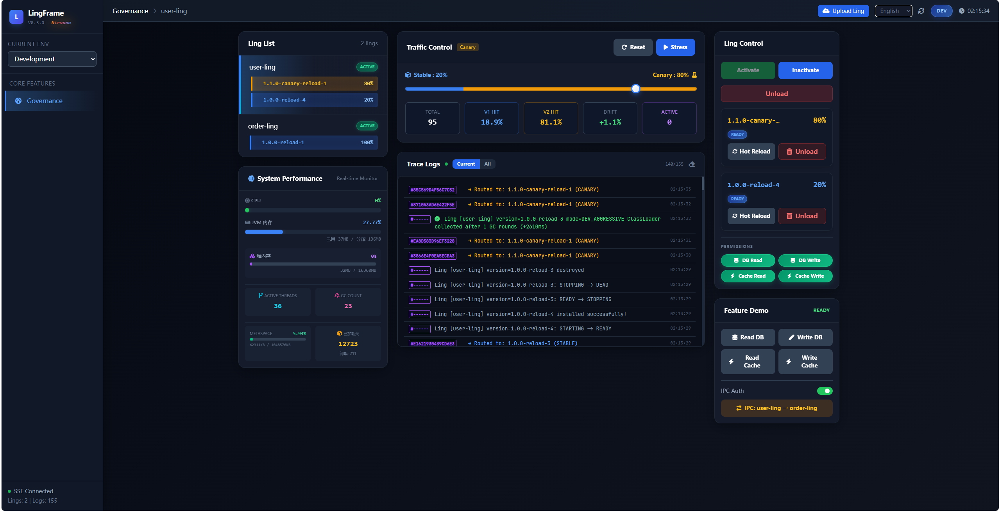

# Dashboard: Governance Control Surface

LingFrame Dashboard in `0.3.0` should be understood first as a runtime governance control surface, not as a frontend showcase.

The shipped codebase exposes a real backend surface for ling lifecycle operations, governance patching, simulation, metrics, health snapshots, and SSE event streaming. The UI is only one consumer of that backend.

Its importance is not just that "there is an admin page".  
It is that the dashboard is already consuming real runtime state, real event streams, and real cleanup evidence from the same governance spine.

## Features Overview

| Feature | What the current implementation provides |
| ------- | ----------- |
| **Ling Management** | List, detail, install, uninstall, uninstall by version, and dev-mode reload |
| **Runtime Control** | Update runtime status through `ACTIVE`, `INACTIVE`, and removal flows |
| **Governance Patch** | Read and update governance policy patches |
| **Permission Governance** | Update DB/Cache permissions and IPC capability grants |
| **Canary Deployment** | Configure canary percentage and canary version routing |
| **Traffic Statistics** | View total requests, version split, active requests, and current window start |
| **Simulation Testing** | Resource simulation, IPC simulation, stress routing, and dev/prod mode switch |
| **Metrics & Health** | JVM metrics, per-ling health snapshots, and all-ling health snapshots |
| **Event Streaming** | Real-time SSE stream backed by monitoring events |

From the project-identity perspective, the dashboard is not only showing governance features.  
It is gathering long-running runtime evidence, unload-side signals, and operational feedback into one control surface.

## Integration Steps

### 1. Add Dependency

```xml
<dependency>
    <groupId>com.lingframe</groupId>
    <artifactId>lingframe-dashboard</artifactId>
    <version>${lingframe.version}</version>
</dependency>
```

### 2. Enable Dashboard

```yaml
lingframe:
  dashboard:
    enabled: true
```

### 3. Runtime Surface

The backend control surface is enabled under:

- REST: `/lingframe/dashboard/**`
- SSE stream: `/lingframe/dashboard/stream`

Install is additionally gated by `lingframe.dashboard.install-enabled=true`.

Reload is only available when `lingframe.dev-mode=true`.


*Figure: one possible UI consumer of the dashboard backend surface.*

## API Endpoints

Once Dashboard is enabled, the following REST APIs are available:

### Ling Management

| Method | Endpoint | Description |
| ------ | -------- | ----------- |
| GET    | `/lingframe/dashboard/lings` | Get all lings |
| GET    | `/lingframe/dashboard/lings/{lingId}` | Get ling details |
| POST   | `/lingframe/dashboard/lings/install` | Upload and install JAR when install is enabled |
| DELETE | `/lingframe/dashboard/lings/uninstall/{lingId}` | Uninstall a ling |
| DELETE | `/lingframe/dashboard/lings/uninstall/{lingId}/{version}` | Uninstall a specific version |
| POST   | `/lingframe/dashboard/lings/{lingId}/reload` | Hot Swap (Dev Mode) |
| POST   | `/lingframe/dashboard/lings/{lingId}/status` | Update ling runtime status |

### Canary Deployment

| Method | Endpoint | Description |
| ------ | -------- | ----------- |
| POST   | `/lingframe/dashboard/lings/{lingId}/canary` | Configure canary strategy |

Request Body Example:
```json
{
  "percent": 10,
  "canaryVersion": "2.0.0"
}
```

### Governance Rules

| Method | Endpoint | Description |
| ------ | -------- | ----------- |
| GET    | `/lingframe/dashboard/governance/rules` | Get all governance rules |
| GET    | `/lingframe/dashboard/governance/{lingId}` | Get one ling governance policy |
| POST   | `/lingframe/dashboard/governance/patch/{lingId}` | Update governance policy |
| POST   | `/lingframe/dashboard/governance/{lingId}/permissions` | Update resource permissions |

### Traffic Statistics

| Method | Endpoint | Description |
| ------ | -------- | ----------- |
| GET    | `/lingframe/dashboard/lings/{lingId}/stats` | Get request totals, version split, active requests, and current window start |
| POST   | `/lingframe/dashboard/lings/{lingId}/stats/reset` | Reset stats |

### Metrics And Health

| Method | Endpoint | Description |
| ------ | -------- | ----------- |
| GET    | `/lingframe/dashboard/lings/metrics` | Get JVM metrics snapshot |
| GET    | `/lingframe/dashboard/lings/{lingId}/health` | Get one ling health snapshot |
| GET    | `/lingframe/dashboard/lings/health/all` | Get health snapshots for all lings |

### Simulation Testing

| Method | Endpoint | Description |
| ------ | -------- | ----------- |
| POST   | `/lingframe/dashboard/simulate/lings/{lingId}/resource` | Simulate resource access |
| POST   | `/lingframe/dashboard/simulate/lings/{lingId}/ipc` | Simulate IPC call |
| POST   | `/lingframe/dashboard/simulate/lings/{lingId}/stress` | Stress test |
| POST   | `/lingframe/dashboard/simulate/config/mode` | Switch runtime test mode between dev and prod |

### Event Streaming

| Method | Endpoint | Description |
| ------ | -------- | ----------- |
| GET    | `/lingframe/dashboard/stream` | Subscribe to SSE monitoring events |

## Usage Examples

### View ling List

```bash
curl http://localhost:8888/lingframe/dashboard/lings
```

### Reload ling in dev mode

```bash
curl -X POST http://localhost:8888/lingframe/dashboard/lings/order-ling/reload
```

### Configure Canary Deployment

```bash
curl -X POST http://localhost:8888/lingframe/dashboard/lings/order-ling/canary \
  -H "Content-Type: application/json" \
  -d '{"percent": 20, "canaryVersion": "2.0.0"}'
```

## Considerations

1. Dashboard is optional and only active when `lingframe.dashboard.enabled=true`.
2. Install is disabled by default and requires `lingframe.dashboard.install-enabled=true`.
3. Reload is a dev-mode capability and is rejected when `lingframe.dev-mode=false`.
4. CORS is open by default in the current implementation; production deployments should add proper access control in front of the dashboard surface.
5. The backend API surface is the `0.3.0` truth source; UI packaging details are secondary to the runtime control contract.
6. Dashboard is best understood as an observation and operation entry for the runtime kernel, not as a separate system alongside it.
