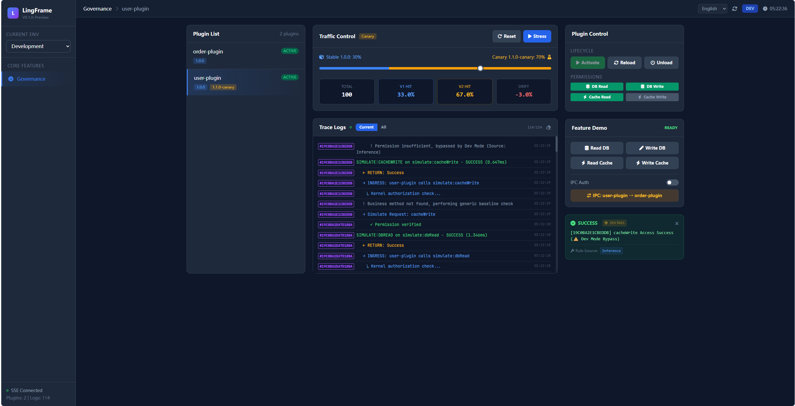

# LingFrame

**JVM Runtime Framework providing ling Architecture and Zero-Downtime Canary Release for Spring Boot**
*Built-in complete permission control and security audit capabilities*

---

## 🚑 What can LingFrame solve for you immediately?

> **Launch new features safely without changing the overall architecture**

* ✅ **Ling-based Business Unit Splitting**: Isolate unstable features from the core system.
* 🚦 **Zero-Downtime Canary Release**: New features only affect a subset of users.
* 🔁 **Fast Rollback**: Enable/Disable Lings without redeploying.
* 🧵 **Full Tracing & Audit Log**: Traceable issues and accountability.

> LingFrame is not for "elegant design",
> It is for **making the system fail less, be controllable, and survive**.

---

## 🧩 Ling-based Spring Boot (Core Capability)

LingFrame runs **Complete Spring Boot Context** as a ling:

* Independent ClassLoader per ling
* Independent Lifecycle (Load / Start / Stop / Uninstall)
* Enable, Disable, Replace on demand
* No need to split into microservices, no network overhead

**You can understand it as:**

> 👉 "**Hot-Pluggable Spring Boot Units**"

### Typical Use Cases

* Put **Experimental / High-Risk Features** in Lings via LingFrame.
* Isolate **Third-Party / Secondary Development Code** from the main system.
* Load **Low-Frequency Features** on demand to reduce complexity.

---

## 🚦 Zero-Downtime Canary Release

LingFrame built-in Ling-level traffic control:

* ling Instance Pool
* Canary / Grey Release
* Label Routing
* ling Version Coexistence

You can achieve:

* New ling **only affects 5% of users**
* **Rollback immediately** if issues arise
* **No restart required** during the process

> For Ops and Devs, this is a **Life-Saving Capability**.

---

## 🧵 Tracing and Audit (Enabled by Default)

LingFrame records:

* ling → ling
* ling → Infrastructure (DB / Cache / MQ)
* ling → LINGCORE App

Every cross-unit call leaves:

* Caller
* Target
* Execution Time
* Permission Result
* Audit Log

> No more guessing when issues happen.

---

## 🛡️ Advanced Capabilities: Runtime Governance & Ecosystem Extension (Long-term Value)

As system scale and complexity rise, LingFrame provides a complete **Governance Kernel** and **Ecosystem Extensibility**:

* 🔐 **Permission Control**: All cross-unit calls must be authorized.
* ⚖️ **Capability Arbitration**: Core acts as the sole proxy, preventing bypass.
* 🧾 **Security Audit**: Meet compliance, risk control, and accountability needs.
* 🔒 **Zero Trust Model**: Lings are untrusted by default.
* 🛡️ **Resilience Governance**: Built-in Circuit Breaker, Rate Limiting, and Timeouts at the method execution level.
* 🔌 **Ecosystem SPIs**: Non-invasively integrate with external ecosystems like Nacos, Consul, Apollo, and SkyWalking via `LingInvocationFilter`, `ServiceExporter`, etc.

> These are not reasons to use it on day one,
> But will **save your life** and drastically simplify architecture when the system gets complex.

---

## 🧠 Core Philosophy: Survive First, Then Establish Order

```text
┌───────────────────────────────────────────────┐
│            Core (Governance Kernel)             │
│   Auth · Audit · Arbitration · Tracing          │
└───────────────────────┬───────────────────────┘
                        ▼
┌───────────────────────────────────────────────┐
│          Infrastructure (Infra Proxy)           │
│     DB / Cache / MQ / Search Unified Control    │
└───────────────────────┬───────────────────────┘
                        ▼
┌───────────────────────────────────────────────┐
│           Business Lings (Business Layer)     │
│      Canary · Rollback · Isolated               │
└───────────────────────────────────────────────┘
```

---

## 🚀 5-Minute Quick Start (Shortest Path)

### Prerequisites

* Java 17+
* Maven 3.8+

### Start LingCore Application

```bash
# Clone Repository (Choose any)
# GitHub (International, Recommended)
git clone https://github.com/LingFrame/LingFrame.git

# AtomGit (China)
git clone https://atomgit.com/lingframe/LingFrame.git

# Gitee (China Mirror)
git clone https://gitee.com/knight6236/lingframe.git

cd LingFrame
mvn clean install -DskipTests

cd lingframe-examples/lingframe-example-lingcore-app
mvn spring-boot:run
```

### Enable ling Mechanism

```yaml
lingframe:
  enabled: true
  dev-mode: true           # Enable dev mode, lings auto-activate after install
  ling-home: "lings"       # Unit JAR directory
  auto-scan: true
  
  # 🔄 Phase 3: Resilience Governance Config
  governance:
    retry-count: 3                    # Global default retry count
    circuit-breaker-enabled: true     # Enable circuit breaker
    rate-limiter-enabled: true        # Enable rate limiter
    default-timeout: 3s               # Default timeout
    bulkhead-max-concurrent: 10       # Max concurrent limit
```


*Figure: ling Management Panel, showing real-time status, canary traffic and audit logs.*

---

## 🧩 Create Your First ling

### Define Interface (Consumer Driven)

```java
public interface UserQueryService {
    Optional<UserDTO> findById(String userId);
}
```

### ling Implementation

```java
@SpringBootApplication
public class UserLing implements Ling {

    @Override
    public void onStart(LingContext context) {
        System.out.println("User ling started");
    }
}

@Component
public class UserQueryServiceImpl implements UserQueryService {

    @LingService(id = "find_user")
    @Override
    public Optional<UserDTO> findById(String userId) {
        return repository.findById(userId);
    }
}
```

### ling Metadata

```yaml
id: user-ling
version: 1.0.0
description: User unit
mainClass: com.example.UserLing
```

---

## 🔄 Cross-ling Call (Auto Governance)

```java
@Component
public class OrderService {

    @LingReference
    private UserQueryService userQueryService;

    public Order create(String userId) {
        return userQueryService.findById(userId)
            .map(Order::new)
            .orElseThrow();
    }
}
```

> All calls automatically pass through:
> Permission Check · Audit · Tracing · Routing Decision

---

## 👤 Who is it for?

* Teams wanting to **Retrofit Monoliths with Lings**
* Systems needing **Zero-Downtime Release / Canary**
* Platforms with **Secondary Dev / Third-Party Extension** needs
* Systems getting complex but not ready for Microservices

---

## 📦 Project Structure

```text
lingframe/
├── lingframe-api
├── lingframe-core
├── lingframe-runtime
├── lingframe-infrastructure
├── lingframe-examples
├── lingframe-dependencies
└── lingframe-bom
```

---

## 🤝 Contributing

* Feature Development
* Example Improvement
* Documentation
* Architecture Discussion

👉 View [Issues](../../issues) / [Discussions](../../discussions)

---

## 📄 License

Apache License 2.0

---

### Final Words

> **LingFrame does not require you to "govern everything" from the start.**
> **It just gives you one more choice before the system gets out of control.**
