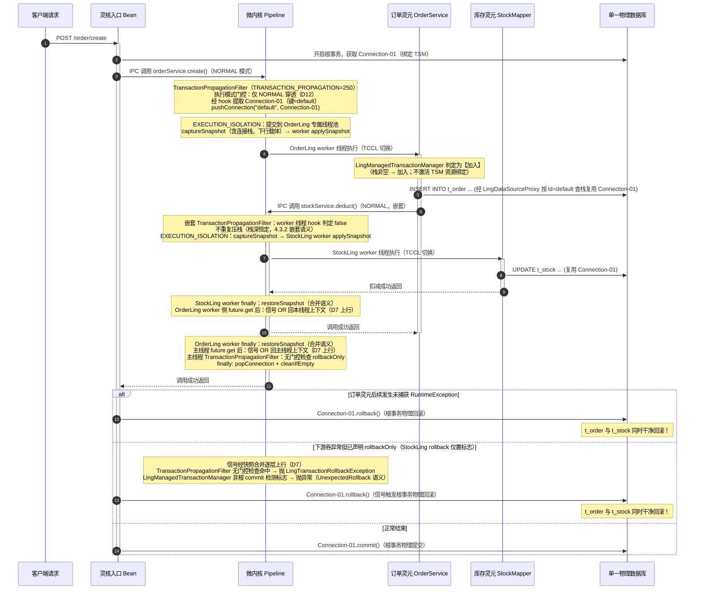
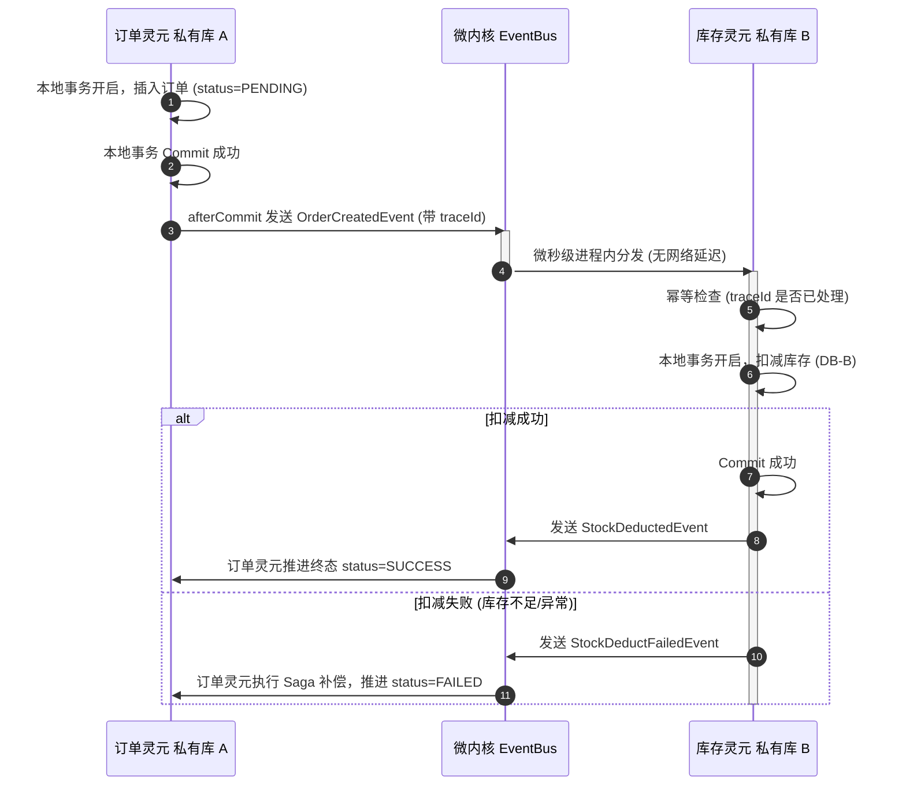

# 灵珑多模数据源架构与跨灵元双轨制事务一致性设计方案（修订版 v6）

> **文件归档**：LingFrame 核心架构演进规范
> **关联决策**：[ADR-0005: 灵珑多模数据源引渡与跨灵元双轨制事务一致性治理架构](../../adr/0005-managed-datasource-and-transaction-propagation.md)
> **适用版本**：LingFrame 0.5.0+
>
> **修订记录**
> - v6（本版）：新增灵元侧引入 JPA 运行期硬边界决策（**D18**），经真实子容器测试 `ManagedJpaBoundaryTest`（5 用例全绿）实证确认：
>   1. **方言强制显式配置**：`LingDatabaseMetaDataProxy` 的 URL 脱敏（`jdbc:lingframe:masked`）导致 Hibernate 方言自动检测失败，灵元必须显式配置 `spring.jpa.database-platform`，否则 `EntityManagerFactory` 启动即崩溃；
>   2. **双事务管理器自动抑制**：`JpaBaseConfiguration.transactionManager` 带 `@ConditionalOnMissingBean`，`lingTransactionManager` 注入后 `JpaTransactionManager` 自动被抑制，无歧义；
>   3. **物理提交权安全降级**：穿透命中时 Hibernate 的 `commit/close/setAutoCommit` 降级为 safe no-op，底层连接生命周期由根事务统一协调；
>   并在决策表追加 D18。
> - v5：按架构演进决策修订，新增一项生命周期策略决策：
>   1. **基础设施灵元只增不减（D17）**：模式 3 存储灵元**本期不提供热卸载**——只允许热挂载，卸载入口禁用，即使闲置也保留（宁可放着不用，也不冒卸载的级联失效与 ClassLoader/驱动回收风险）；`ManagedDataSourceRegistry.unregister` 保留为 API 但基础设施路径不触发；
>   2. **业务灵元卸载不受影响**：模式 2 私有库灵元维持既有热卸载能力，驱动反注册仍走既有 `LingUnloadHook` 四层回收（决策 D14）；
>   并同步：§1.3/§1.4 模式 3 定义与对比表、决策表 D5/D14/D17、§3.1 资产表、§3.2 断点图、§6 防线（第 3/5 道与 §6.3 卸载语义）、约束 2、Roadmap Phase 6/7 全部改为「基础设施只增不减」口径。
> - v4：按生产级评审意见修订，新增两项决策与一处边界声明：
>   1. **TSM 共享启动期自检（D15）**：穿透地基 = 灵核与灵元共享同一份 `TransactionSynchronizationManager`——装配期用 `Class.forName` 做 Class 身份比较，不一致 → 启动期 WARN：穿透不激活，把「父委派配置错误的静默失效」提升为「启动期可见」；
>   2. **穿透总开关与降级路径（D16）**：新增配置键 `lingframe.tx.propagation.enabled`（默认 `true`），`false` 时 Filter 直接放行、灵元侧不注册受管事务管理器——应急时「先关穿透，业务退回模式 2 + EventBus 最终一致兜底，再排查」；
>   3. **D9 接受的残余风险声明**：poisoned-close 缩小并发窗口但未消灭——worker 阻塞在不可中断 I/O 时，join 超时后 close 与 worker 并发访问同一 Connection 仍是未定义行为，宽限期是概率性缓解而非硬保证；
>   并补：约束 1 隔离级别/readOnly 心智差异提示、Roadmap 线程池拒绝提交测试项（Phase 3）与契约自检专项（Phase 8）、约束 4 引用 D15、§4.1 装配逻辑与 §4.3.2 Filter 门控对齐 D16。
> - v3：按生产级评审意见修订。v2 修好了「连接」的跨线程搬运，但事务一致性需要的**全部状态**没有一起搬运。根因与修复：
>   1. **rollbackOnly 信号链断裂**：事务状态 = 资源（连接）+ 信号（rollbackOnly）。信号写入端在 worker 线程、判定端在主线程，v2 的快照 restore 是「覆盖」语义——worker 期间置位的回滚信号会被恢复动作丢弃，产生**静默部分提交**。v3 把快照升级为**双向载体**（下行携带连接、上行携带信号），restore 改为**合并**语义（决策 D7）；
>   2. **穿透上下文缺数据源身份维度**：v2 的连接查找是线程级全局栈，混合链路（受管事务中调用模式 2 私有库灵元）会发生**串库**（灵元自以为写私有库，SQL 落到灵核库）。v3 让受管代理显式携带 `dataSourceId`、模式 2 私有代理永不查栈（决策 D8），并修正模式 3「跨模块原子回滚」的过度声明（跨 dataSourceId 无 2PC，仅 best-effort 逐库回滚）；
>   3. **GOVERN_ONLY 穿透语义错误**：v2 声称 GOVERN_ONLY「语义与 NORMAL 完全一致」——错。`InvocationExecutionMode.GOVERN_ONLY` 的 `invokeTerminal=false`（不进终端调用），push 的连接无消费者。v3 明确**仅 NORMAL 模式穿透**，SIMULATION / GOVERN_ONLY 直接放行（决策 D12）；
>   4. **超时/放弃执行 × 共享物理连接**：resilience 超时后主线程回滚连接、被放弃的 worker 仍可能并发执行 SQL——JDBC Connection 非线程安全。v3 补 cancel + 有界 join + poisoned 连接逃生舱（决策 D9）；
>   5. **LingManagedTransactionManager 只有加入路径**：根路径（灵元为事务根）的借连接 / setAutoCommit / commit / rollback / 判根规则从未被规格化。v3 补完整规格（决策 D13），非根 commit 检测 rollbackOnly 时抛异常（对齐 Spring `UnexpectedRollbackException` 语义）；
>   6. **no-op 降级连审计一起降级**：`NonCloseableLingConnectionProxy` 把 commit/rollback 覆盖为空实现时**绕过了 `checkTransactionPermission`**。v3 确立「降级物理行为、保留治理检查与审计」原则（决策 D10），并补 `setTransactionIsolation` / `setReadOnly` / `setHoldability` 拦截；
>   7. **事务根管理器类型边界未声明**：JPA 根（`JpaTransactionManager`）的物理连接封装在 EntityManager 内，hook 无法提取，穿透静默失效。v3 显式声明边界 + 启动期检测告警（决策 D11）；
>   8. **卸载设计与既有四层回收体系脱节**：驱动反注册改挂既有 `LingUnloadHook`（core.spi，手册 §6.11 ①卫生层），不新造钩子通道（决策 D14）；
>   9. **事实性修正**：ADR 链接断链修复；§3.1 资产表包归属与行数对齐代码事实；删除虚构的 `LingContext.getManagedDataSourceRegistry()` 静态方法（改为 `SpringLingContainer` 装配参数注入）；`LingConnectionProxyFactory` 标注「手册引用但代码未检出」的实现缺口；补 hook 装配路径、嵌套调用栈深恒定语义、SIMULATION 门控、穿透持有时长运营边界、可观测性指标、Roadmap 测试项（信号传播 / 串库防护 / 超时废弃 / 审计不降级 / JPA 降级）。
> - v2：按生产级标准修订。修正 v1 的三个致命问题：
>   1. **跨线程穿透断裂**：v1 依赖单线程 ThreadLocal 传递事务连接，但 `ThreadIsolationGovernanceFilter`（`EXECUTION_ISOLATION`）在 NORMAL 模式下把终端执行提交到每灵元专属线程池，v1 的连接必然丢失——本版通过接线既有 `ThreadLocalPropagator` SPI 修复；
>   2. **core 引入 Spring 违例**：v1 把依赖 `TransactionSynchronizationManager` 的过滤器放进 `lingframe-core`，违反「core 不以 Spring 为设计前提」模块边界——本版事务状态提取 SPI 化，Spring 实现下沉 runtime starter；
>   3. **事务发起方自相矛盾**：v1 同时声称「灵元容器不注册事务管理器」与「OrderLing @Transactional 开启事务」——本版明确**事务根模型**（根 = 调用链上第一个 `@Transactional` 边界）。
>   并补充：受管数据源独立总线（不污染 `LingServiceRegistry`）、卸载反向引用解除时序（防父→子强引用泄漏）、FilterRegistry/PipelineArchitectureContractTest 同步要求、配置键归入 `lingframe.*` 前缀。

---

## 一、 三大数据源与事务架构模式全面定义（Taxonomy & Paradigms）

在 JVM 微内核与灵珑架构演进中，针对灵元如何访问数据库、如何管理连接池以及如何保证事务一致性，存在三种本质不同的架构范式：

### 1.1 模式 1：基础设施托管模式 (Managed DataSource Pattern) ——【单体微核演进，开箱即用推荐态】
- **核心定义**：灵核作为 PaaS 基础设施底座静态托管单一物理连接池（HikariCP/Druid）和事务管理器（启动时配置固定、运行时不可变）。灵核自身 0 业务代码、0 业务表；所有业务逻辑由业务灵元实现。业务灵元无需配置任何 JDBC 参数，声明式接入底座受管数据源，通过逻辑表隔离业务。
- **架构定位**：这是工程便利性与架构纯洁性之间的务实权衡——灵核承担了一项基础设施责任（JDBC 连接池），换取全局事务打通的极简体验。
- **事务哲学**：**单机本地 ACID 强事务**。微内核通过调用流水线（Pipeline）在跨 ClassLoader 跨灵元调用时透明穿透当前线程绑定的物理 `Connection`。任何灵元抛出未捕获异常，触发全链路本地原子回滚。
- **一致性目标**：**强一致**（本方案第一优先目标）。
- **适用场景**：绝大多数企业核心业务（ERP、CRM、电商、若依改造等），开发者追求和传统 Spring Boot 相同的开发体验与本地强一致性。

### 1.2 模式 2：领域完全自治模式 (Database-per-Ling Pattern) ——【进程内微服务，完全物理隔离态】
- **核心定义**：每个灵元自建独立连接池（通过自身 `spring.datasource.url`），连接独立的物理数据库实例（如订单库、用户库、甚至异构的 MongoDB/PG）。灵核纯粹负责生命周期治理，对数据库完全无感知。
- **事务哲学**：**最终一致性 (Eventual Consistency)**。由于物理上是不同的数据库连接，物理单机 ACID 绝对无法生效。必须通过微内核的单进程极速 `EventBus` 进行事件驱动（EDA）与轻量 Saga 补偿。
- **一致性目标**：**最终一致**（本方案第二轨道目标）。
- **适用场景**：多租户物理分库、异构数据库接入、混合存储系统、以及涉及外部不可逆 I/O（短信、支付）的业务。

### 1.3 模式 3：基础设施灵元化模式 (Storage-Ling Pattern) ——【终极组件化，极限纯洁扩展态】
- **核心定义**：灵核保持极致的“0 存储、0 JDBC 依赖”。连接池与存储管理能力本身被打包为一个或多个专职的基础设施存储灵元（`lingframe-infra-storage`），运行时动态挂载，各自持有独立连接池（可异构，如同时挂载 MySQL 存储灵元 + PG 存储灵元 + ClickHouse 存储灵元）。各存储灵元向微内核服务总线以不同 `dataSourceId` 注册受管数据源，再供给上层业务灵元使用。
- **与模式 1 的本质区别**：
  - **数据源生命周期动态性**：模式 1 的连接池随灵核启动时固定，运行时不可变；模式 3 的存储灵元支持运行时**热挂载**，数据源拓扑可动态增加（**热卸载延后：基础设施层只增不减**，见约束 2/决策 D17）；
  - **异构多源能力**：模式 1 通常为单一同构连接池；模式 3 可同时挂载多个存储灵元对应不同类型的数据库；
  - **JDBC 驱动生命周期**：模式 1 的 JDBC 驱动常驻灵核 ClassLoader；模式 3 的驱动 jar 随存储灵元 ClassLoader 一同加载和回收。
- **事务哲学**：**支持本地/穿透强事务（同一 dataSourceId 链路内）**。上层业务灵元面向统一受管契约编程，底座获得存储引擎动态热切、多云存储适配的能力。**诚实边界**：跨 dataSourceId（同一调用链写多个存储灵元对应的多个物理库）无 2PC，回滚为 best-effort 逐库执行——中途失败仍可能部分回滚，跨库强一致需求必须走模式 2 的 Saga 轨道。
- **一致性目标**：**强一致**（同一 dataSourceId 链路内；与模式 1 同属强一致轨道）。
- **适用场景**：边缘计算网关、无 JDBC 纯计算节点、云原生动态热切库场景、以及需要运行时按需引入新数据库类型的场景。

### 1.4 三大模式全景决策对比表

| 比较维度 | 模式 1：基础设施托管 (推荐态) | 模式 2：领域完全自治 (隔离态) | 模式 3：基础设施灵元化 (扩展态) |
| :--- | :--- | :--- | :--- |
| **数据源持有方** | 灵核底座统一持有物理连接池 | 各业务灵元自建独立连接池 | 一个或多个专职存储灵元各自持有连接池 |
| **数据源生命周期** | **静态**（启动时配置固定，运行时不可变） | **静态**（灵元启动时自建，随灵元生灭） | **动态挂载**（存储灵元运行时热挂载；热卸载延后，只增不减） |
| **异构多源能力** | 单一同构连接池 | 各灵元各自连接异构库 | 多个存储灵元可同时对接不同类型数据库 |
| **连接池数量** | 单一物理连接池（池集约化） | N 个灵元占用 N 个连接池（碎片化） | 按存储灵元数量组件化管理 |
| **一致性轨道** | **强一致**（本地 ACID 强事务，单机物理回滚） | **最终一致**（EventBus + Saga 补偿） | **强一致**（同一 dataSourceId 链路内本地 ACID；跨源 best-effort） |
| **跨模块原子回滚** | **支持**（单一连接池，Pipeline 穿透共享物理 Connection）| **不支持**（必须依靠补偿与重试） | **同一 dataSourceId 链路内支持**（受管契约引渡连接）；跨 dataSourceId 无 2PC，仅 best-effort 逐库回滚 |
| **灵核纯洁度** | 中（需包含 JDBC 连接池 + 驱动） | 极高（灵核 0 存储依赖） | 极高（灵核 0 存储/0 JDBC 依赖） |
| **业务开发心智** | 极低（与普通 Spring Boot 100% 一致） | 中（需处理异步重试、幂等与状态机） | 极低（面向统一受管契约编程） |
| **运行时可演化性** | 不支持（新增数据源需停机改配置重启） | 不支持（灵元自建时固定） | **支持**（热挂载新存储灵元即引入新数据源） |
| **现状支持度** | **规划中（本次 ADR-0005 落地）** | **已原生支持（LingDataSourceRegistrar）** | **规划中（本次 ADR-0005 落地）** |

### 1.5 灵珑演进战略：“推荐 1，保留 2，扩展 3”（双轨制事务治理）
- **商业与体验落地**：**默认推 1**。绝大多数用户从传统单体迁来，对事务回滚有绝对依赖，模式 1 能够让企业以 0 学习成本平滑拆解模块。坏的一面是灵核必须承担 JDBC 连接池的基础设施责任，无法达到极致的 0 依赖纯洁性；
- **架构兼容与解耦**：**保留 2**。对已经使用独立数据源或异构存储的灵元，通过单进程微核 EventBus 建立进程内最终一致性通道；
- **动态多源与极致纯洁**：**扩展 3**。通过契约归一化，让受管数据源本身具备灵元化动态外挂的能力，支持运行时按需引入新类型数据库，同时保障灵核 0 JDBC 依赖的架构纯洁性。

---

## 二、 现状痛点与多模数据源破局诉求

### 2.1 现状与痛点
在 LingFrame 0.4.0 以前：
1. **持久层支持单一**：底层仅支持“模式 2（独立数据源模式）”，当灵元配置 `spring.datasource.url` 时在灵元内部自建连接池；
2. **跨灵元事务割裂**：模式 2 下灵元 A 调 灵元 B，由于使用各自独立的物理连接池，Spring `@Transactional` 无法跨边界回滚，数据一致性只能依赖应用层业务补偿；
3. **零业务灵核（Zero-Business LingCore）的挑战**：在存量若依改造中，灵元通过反向 Pinning 灵核业务 Service 规避了数据源问题；但在纯微内核治理中心架构下，灵核无任何业务表与业务代码，灵元必须自持持久层能力；
4. **服务契约目录无基础设施总线能力**：`LingServiceRegistry` 是 FQSID → 方法签名/提供方权重的服务契约目录（`registerServiceMetadata` / `getProvidersByContractId` / `registerProvider`），**没有**泛型 `getService(Class, id)` 基础设施 Bean 查找能力。受管数据源若直接塞进服务注册表，既语义错配又会触发契约过滤逻辑（灵核 `LingCoreServiceRegistrarProcessor` 的排除名单里本就包含 `dataSource` / `transactionManager` 前缀），必须新建独立总线；
5. **跨 ClassLoader 事务可见性陷阱**：Spring 的 `TransactionSynchronizationManager` 是**静态 ThreadLocal 单例**。灵核与灵元若各持一份 Spring 栈（各自 ClassLoader），两边的活跃事务状态互相不可见；灵珑依赖 runtime 注入的 Spring 生态包父委派（共享同一份 TSM），这是穿透可行的前提，但必须是显式契约而非巧合；
6. **线程隔离与 ThreadLocal 的天然冲突**：`ThreadIsolationGovernanceFilter` 在 NORMAL 模式下把终端执行 `executor.submit` 到每灵元专属线程池，靠 `LingCallContextSnapshot.capture()/apply()/restore()` 搬运调用上下文。任何想靠“同线程 ThreadLocal”传递的连接状态，都会在跨线程边界静默丢失——**这是 v1 方案失效的根因，本版所有穿透设计必须显式考虑线程边界**。

### 2.2 多模数据源破局哲学
通过 `ManagedDataSourceProvider` 契约归一化，将模式 1 和模式 3 统摄在相同的数据源引渡规范下：
- 上层业务灵元面向统一受管契约编程，零数据源配置，享受本地 ACID 强事务；
- 底层连接池既可由灵核开箱即用静态托管（模式 1），亦可由一个或多个专职存储灵元运行时动态外挂提供（模式 3）；
- 模式 2 保留独立连接池，但通过 EventBus + 幂等 + Saga 纳入进程内最终一致性轨道。

---

## 三、 现有资产盘点与断点微创缝合

本方案严格遵守 **KISS 原则**，严禁闭门造车和重复发明轮子，全部基于现存代码资产进行“微创手术式”增强。

### 3.1 现有资产（直接复用，逐项对齐代码事实）

| 模块 / 类 | 既有能力（代码事实） | 本方案复用方式 |
| :--- | :--- | :--- |
| `lingframe-infra-storage` | 官方现存的 JDBC 基础设施代理模块 | 继续作为存储代理的核心承载层 |
| `DataSourceWrapperProcessor` | `@Order(HIGHEST_PRECEDENCE)` BPP 拦截包装器；对已是 `LingDataSourceProxy` 的 Bean 幂等跳过；`@ConditionalOnClass(DataSource)` 保证无 JDBC 环境不报错 | 继续作为 `DataSource` 统一包装入口（灵核侧模式 1 与存储灵元侧模式 3 共用） |
| `LingDataSourceProxy` | 实现 `DataSource`，`getConnection()` 返回 `LingConnectionProxy` 治理代理；`getConnection(user, pwd)` 直接拒绝（强制使用配置凭据）；`unwrap()` 拒绝暴露原生 HikariDataSource | 作为向灵元子容器单向引渡的标准代理；改造 `getConnection()` 增加穿透复用（改造点 2） |
| `LingConnectionProxy` | 实现 `Connection`（359 行全委托），拦截 `commit/rollback/setAutoCommit` 并做事务权限审计（`checkTransactionPermission`） | 继续作为物理连接的安全审计与管控代理；穿透连接复用其非关闭变体 |
| `InvocationPipelineEngine` | 微内核请求调用流水线；`FilterPhase` 常量（PROVIDER_ROUTING=-100 → METRICS=0 → STATE_GUARD=100 → ROUTING=200 → POLICY_PREFILL=240 → RESILIENCE=300 → RESOLUTION=400 → GOVERNANCE=500 → GOVERNANCE+50 → EXECUTION_ISOLATION=600 → TERMINAL=MAX）；`FilterRegistry` 维护内置过滤器顺序契约并拒绝 SPI 占用保留位 | 在管道中挂载事务上下文穿透过滤器（改造点 3），并同步 `FilterRegistry` 保留位与契约测试 |
| `ThreadIsolationGovernanceFilter` | `EXECUTION_ISOLATION` 阶段；NORMAL 模式将终端执行 `submit` 到每灵元线程池，用 `LingCallContextSnapshot` + `InvocationContext.attach/detach` 跨线程搬运上下文，`finally` 恢复 TCCL 与快照 | **必须改造**：接入事务上下文传播器，把穿透连接随任务搬运到 worker 线程（改造点 3 的线程边界部分） |
| `ThreadLocalPropagator<T>` SPI（`core.spi`） | 已定义 `capture() / replay(snapshot) / restore(snapshot)` 三方法契约，**尚未接线到任何执行器** | 作为跨线程搬运事务上下文的标准 SPI，由 `ThreadIsolationGovernanceFilter` 统一调用 |
| `LingCallContextSnapshot`（`core.pipeline`） | `capture()/apply()/restore()` 搬运 `LingCallContext`（lingId/labels/traceId） | 参照其模式实现事务快照传播；traceId 继续作为模式 2 幂等键 |
| `InvocationContext` | Pipeline 唯一“通行证”；四分区（routing/resolution/governance/execution）；运行时对象（`RoutableTarget`）一律 `WeakReference`；resolution 分区允许短暂持有 ClassLoader/Class 强引用但 `reset()` 必须物理清空 | 约束新增过滤器不得把连接等长生命周期对象塞入 `InvocationContext` 强引用分区（连接只走 `LingTransactionContext`，不进 ctx） |
| `EventBus`（`core.event`） | 进程内事件总线；`subscribe(lingId, ...)` 灵元级监听在 `unsubscribeAll(lingId)` 卸载时自动清除；全局监听 `subscribeGlobal`；异步队列带溢出策略 | 模式 2 最终一致性的进程内分发通道（已有资产，零新增） |
| `LingCoreServiceRegistrarProcessor` | 把灵核 implements 业务接口的 Bean 注册进服务契约目录；排除名单含 `dataSource` / `transactionManager` / `entityManagerFactory` 前缀 | **微创**：保留排除名单（那是服务契约语义，不是数据源封杀），另建受管数据源总线注册通道（不触碰该排除逻辑） |
| `LingDataSourceRegistrar`（runtime starter） | 由 `SpringLingContainer.registerBeans` 静态调用 `register(context, lingClassLoader, lingId)`；受 `lingframe.ling.auto-datasource` 开关守卫；仅在灵元配置 `spring.datasource.url` 时自建独立连接池（模式 2 现状路径），无 url 时直接跳过 | 增加分支 B：无 url 时从受管数据源总线拉取代理注入（改造点 1）；总线实例经 `SpringLingContainer` 装配参数传入，**不虚构 `LingContext` 静态访问器** |
| `LingUnloadCoordinator`（`core.ling`）/ `LeakDetector`（`core.spi`）/ `LingUnloadHook`（`core.spi`） | 卸载清理协调器（编排层，持有 `LeakDetector`）；泄漏探测器 SPI（默认实现 `DefaultLeakDetector` 在 `core.resource`）；跨切面 JVM/生态泄漏清理钩子（手册 §6.11 ①卫生层，JDBC 驱动反注册的既有归属） | **业务灵元**（模式 2 私有库）卸载：驱动反注册（挂**既有** `LingUnloadHook`，不新造钩子通道）；**基础设施灵元（模式 3）本期不提供热卸载**（决策 D17），`LingUnloadCoordinator` 仅服务于业务灵元卸载编排（改造点 4） |
| 手册 §6.9 非 Bean 数据源代理边界 | 诚实边界：`DriverManager` / 手搓连接 / 非 Bean 池可绕过治理，须显式 `LingConnectionProxyFactory.wrap(...)`。⚠️ 事实核查：**该类当前代码中不存在**（仅手册引用）——落地前须先补齐该工厂或修正手册口径，属既有文档债 | 本方案的受管范围同样止于 Bean 代理路径，文档表述必须与之一致，不吹全路径沙箱 |

### 3.2 核心断点与微创改动点（四个断点）

```
┌────────────────────────────────────────────────────────────────────────────────────────┐
│ 改造点 1：装配断点 (LingDataSourceRegistrar + ManagedDataSourceRegistry)               │
│   • 新建受管数据源独立总线（api 契约 + runtime 实现）                                 │
│   • 灵元未配 url 时，按 dataSourceId 从总线取 LingDataSourceProxy 注入                │
│   • 灵元容器注册 LingManagedTransactionManager（双路径，不激活 TSM 绑定）             │
└─────────────────────────────────────────┬──────────────────────────────────────────────┘
                                          │                                               
┌─────────────────────────────────────────▼──────────────────────────────────────────────┐
│ 改造点 2：连接复用断点 (LingDataSourceProxy.getConnection)                             │
│   • 优先复用 LingTransactionContext 中当前线程的穿透物理 Connection                   │
│   • 活跃事务存在时返回 NonCloseableLingConnectionProxy（防早关/早提/改 autoCommit）   │
└─────────────────────────────────────────┬──────────────────────────────────────────────┘
                                          │                                               
┌─────────────────────────────────────────▼──────────────────────────────────────────────┐
│ 改造点 3：流水线透传断点 (TransactionPropagationFilter + 线程搬运)                     │
│   • ROUTING 之后、RESOLUTION 之前挂载穿透过滤器（事务状态经 SPI 提取，core 零 Spring）│
│   • ThreadIsolationGovernanceFilter 接线 ThreadLocalPropagator：capture 携带          │
│     连接快照、worker apply、finally restore —— 解决跨线程穿透                        │
└─────────────────────────────────────────┬──────────────────────────────────────────────┘
                                          │                                               
┌─────────────────────────────────────────▼──────────────────────────────────────────────┐
│ 改造点 4：业务灵元卸载反注册断点 (LingUnloadCoordinator 钩子)                            │
│   • 业务灵元（模式 2 私有库）卸载：驱动反注册（挂既有 LingUnloadHook）                  │
│   • 基础设施灵元（模式 3）本期不提供热卸载（决策 D17：只增不减），卸载入口禁用          │
└────────────────────────────────────────────────────────────────────────────────────────┘
```

### 3.3 架构修订核心决策总表（D1–D6 基础决策，D7–D14 扩展决策）

| 决策 | 内容 | 解决什么问题 |
| --- | --- | --- |
| D1 事务根模型 | 根 = 调用链上第一个 `@Transactional` 边界；受管模式灵元容器注册 `LingManagedTransactionManager`（**双路径**，不激活 TSM 资源绑定，完整规格见 §4.6）；`REQUIRES_NEW` 物理不可达，显式降级为加入并告警 | v1：事务发起方自相矛盾 |
| D2 事务状态提取 SPI 化 | api 定义 `LingTransactionContext`（纯 JDK）；`core.spi` 定义 `TransactionBindingHook`；Spring 实现（`TransactionSynchronizationManager` + 连接提取）放 runtime starter | v1：core 引入 Spring 违例 |
| D3 受管数据源独立总线 | api 契约 `ManagedDataSourceRegistry` + `ManagedDataSourceProvider`；实现与装配在 runtime；不触碰 `LingServiceRegistry` 排除名单 | v1：服务总线语义错配 |
| D4 跨线程穿透 | `ThreadIsolationGovernanceFilter` 接线既有 `ThreadLocalPropagator` SPI，capture/apply/restore 搬运事务上下文 | v1：跨线程 ThreadLocal 丢失 |
| D5 防泄漏反向引用解除 | `ManagedDataSourceRegistry` 提供 `unregister` 作为受管数据源生命周期管理 API；基础设施灵元**本期不卸载**（D17），`unregister` 保留为运维停用/未来能力预留；`LingTransactionContext` 只在调用链存活期内持连接强引用，`finally` 双端（主线程 + worker）擦除 | v1：强引用导致 ClassLoader 无法回收 |
| D6 契约与配置同步 | 新增内置过滤器同步更新 `FilterRegistry.RESERVED_BUILTIN_ORDERS` + `assertOrder` + `PipelineArchitectureContractTest`；配置键统一 `lingframe.*` 前缀，默认 `dataSourceId="default"` 与 ADR 3.1 一致；order 落地为具名常量 `FilterPhase.TRANSACTION_PROPAGATION`（不裸写 `ROUTING + 50`） | v1：FilterRegistry 遗漏、魔法键、默认值不一致 |
| **D7 信号完整性（双向快照）** | 事务状态 = 资源（连接，向下传递）+ 信号（rollbackOnly，向上回传）。`TransactionSnapshot` 是**双向载体**：下行携带连接栈引用，上行携带合并后的 rollbackOnly；`restore` 语义为**合并**（`previous ∪ worker 执行期间置位`）而非覆盖；信号经 `ThreadIsolationGovernanceFilter` 主线程侧（`future.get()` 之后）写回主线程 `LingTransactionContext` | 修复：rollbackOnly 写在 worker、判在主线程，覆盖式 restore 丢弃信号 → 静默部分提交 |
| **D8 数据源身份维度** | 受管 `LingDataSourceProxy` 构造时显式携带 `dataSourceId`，穿透查找 = 代理自身 id 精确查栈；模式 2 私有池代理**无 id、永不查栈**（串库断绝）；`TransactionBindingHook` 带 `dataSourceId` 参数，`TransactionPropagationFilter` 按 hook 报告的活跃绑定源集合压栈 | 修复：线程级全局栈无身份维度，混合链路串库（私有库灵元的 SQL 落到灵核库） |
| **D9 放弃执行安全** | 超时/放弃执行时对穿透连接执行：`cancel(true)` → 有界 join（宽限期 `lingframe.ling.transaction.abandoned-join-timeout`，默认 2s）→ 超宽限期则连接标记 poisoned（跳过 `rollback()` 直接 `close()` 废弃 + ERROR 事件 + 指标） | 修复：resilience 超时后主线程回滚与被放弃 worker 并发访问同一物理连接（JDBC Connection 非线程安全） |
| **D10 审计不降级** | `NonCloseableLingConnectionProxy` 降级的只是**物理行为**（commit/rollback/setAutoCommit/setTransactionIsolation/setReadOnly/setHoldability 置为 no-op 或忽略），`checkTransactionPermission` 权限检查与审计事件**全部保留** | 修复：no-op 覆盖绕过事务权限门，违反「治理语义必须可证明」 |
| **D11 事务根类型边界** | 穿透前提 = 根事务管理器为 `DataSourceTransactionManager`（JDBC 资源绑定，TSM 资源键即受管代理实例）；JPA 根（`JpaTransactionManager`）物理连接封装在 EntityManager 内不可提取 → 穿透不激活，灵元 SQL 独立提交；runtime 装配时检测灵核 `PlatformTransactionManager` 类型，非 JDBC 型输出 WARN | 修复：JPA 根场景穿透静默失效，无任何声明与告警 |
| **D12 执行模式门控** | **仅 NORMAL 模式穿透**：SIMULATION（终端只做模拟，无真实副作用）与 GOVERN_ONLY（`invokeTerminal=false`，不进终端，push 的连接无消费者）一律直接放行 | 修复：声称「GOVERN_ONLY 语义与 NORMAL 完全一致」错误——GOVERN_ONLY 无终端调用，穿透无意义 |
| **D13 TM 完整规格** | `LingManagedTransactionManager` 根/加入判定真源 = 借出时刻 `LingTransactionContext` 栈空与否；根路径：借连接（普通 `LingConnectionProxy`）→ `setAutoCommit(false)` → push → commit/rollback 物理执行 + pop + close 归还池；加入路径：非根 commit 前检测 rollbackOnly，置位则抛 `LingTransactionRollbackException`（对齐 Spring `UnexpectedRollbackException` 语义）；隔离级别/readOnly 仅根路径生效（借出时设置），timeout 由流水线 resilience 治理兜底而非 TM 实现 | 修复：只有加入路径被规格化，根路径（纯灵元发起业务事务）行为未定义 |
| **D14 卸载对齐四层回收** | 业务灵元（模式 2 私有库）卸载时的驱动反注册挂**既有** `LingUnloadHook`（core.spi，手册 §6.11 ①卫生层）；依赖反压检查归 `LingUnloadCoordinator` 编排；总线反注册归总线自身职责——不新造任何钩子通道。**基础设施灵元（模式 3）本期不提供热卸载**（D17），其生命周期只增不减 | 修复：防泄漏设计独立于既有回收体系构思，职责重复 |
| **D17 基础设施只增不减（热卸载延后）** | 基础设施灵元（模式 3 存储灵元）**本期不提供热卸载**——只允许热挂载，禁用卸载入口；即使闲置也保留（宁可放着不用，也不冒卸载的级联失效与 ClassLoader 回收风险）。`ManagedDataSourceRegistry.unregister` 保留为 API 但基础设施路径不触发；业务灵元（模式 2）卸载不受影响，仍走既有四层回收 | 新增决策：承载型基础设施的卸载级联风险（依赖它的业务灵元连接池失效）与回收复杂度，比「闲置占用」的成本高——卸载延后 |
| **D15 TSM 共享启动期自检** | 穿透地基 = 灵核与灵元共享同一份 `TransactionSynchronizationManager`（spring-tx 父委派）。灵核 starter 装配时用 `Class.forName(TSM, false, 各 ClassLoader)` 做 **Class 身份比较**，不一致（父委派配置错误、两栈分叉）→ 输出 WARN：穿透不激活，受管灵元 SQL 独立提交——与 D11 同手法，把「静默失效」提升为「启动期可见」 | 修复：TSM 跨 ClassLoader 共享只是契约声明，无运行时自检；父委派出错时穿透静默失效且无任何报错 |
| **D16 穿透总开关与降级路径** | 新增配置键 `lingframe.tx.propagation.enabled`（默认 `true`）。`false` 时：`TransactionPropagationFilter` 直接放行（不 push）、`LingManagedTransactionManager` 不注册（灵元退回独立连接心智）——提供明确的应急降级路径：「线上出现穿透机制自身引发的疑难时，先关总开关，业务退回模式 2 + EventBus 最终一致兜底，再排查」 | 修复：复杂度高但无「整体关闭穿透」的运行层开关，应急只能改代码排查 |
| **D18 灵元侧 JPA 运行期硬边界** | 灵元引入 `spring-boot-starter-data-jpa` 时：① URL 脱敏（`jdbc:lingframe:masked`）导致 Hibernate 方言自动推导失效，必须显式配置 `spring.jpa.database-platform`；② JPA 自动装配的 `JpaTransactionManager` 被灵珑 `@Primary` 的 `lingTransactionManager` 自动抑制，无注入歧义；③ 穿透命中时返回 `NonCloseableLingConnectionProxy`，Hibernate 提交/关闭权降级为 no-op，由根事务统一提交回滚 | 补全：消除灵元侧引入 JPA 的空白区，实测（`ManagedJpaBoundaryTest` 5 用例全绿）确立硬约束 |

---

## 四、 详细代码级实现方案（v3）

### 4.0 新增契约与基础设施（决策 D1/D2/D3/D7/D8 落地）

以下新类型按模块边界放置：

| 新类型 | 归属模块 | 职责 | 依赖约束 |
| --- | --- | --- | --- |
| `LingTransactionContext` | **lingframe-api**（`com.lingframe.api.storage`） | 调用链存活期内持有穿透 `Connection`（按 dataSourceId 分栈的 ThreadLocal + **双向快照对象** `TransactionSnapshot`：下行携带连接栈、上行携带 rollbackOnly 信号），纯 JDK 类型 | 不依赖任何 Spring / core 类型；被 core 过滤器与 infra-storage 代理共享 |
| `TransactionSnapshot` | **lingframe-api**（`com.lingframe.api.storage`，`LingTransactionContext` 的嵌套静态类） | 跨线程搬运载体：**可变对象**，`stacks`（连接栈引用，下行）+ `rollbackOnly`（volatile boolean，上行）；restore 时执行合并语义（D7） | 随 `LingTransactionContext` 同模块，纯 JDK |
| `ManagedDataSourceProvider` | **lingframe-api** | 数据源供给 SPI：`getDataSource()` + 默认 `getDataSourceId()="default"` | 仅依赖 `javax.sql.DataSource` |
| `ManagedDataSourceRegistry` | **lingframe-api** | 受管数据源独立总线：`register / unregister / lookup(dataSourceId)` | 只做注册与查找，不承载服务契约语义 |
| `TransactionBindingHook` | **lingframe-core**（`core.spi`） | 事务状态提取 SPI：`Set<String> getActiveBoundDataSourceIds()` / `Connection getBoundConnection(String dataSourceId)` / `boolean isTransactionActive()`；core 过滤器只面向该 SPI | core 零 Spring 依赖（与既有 `ThreadLocalPropagator` 同级） |
| `SpringTransactionBindingHook` | **lingframe-runtime**（starter） | 基于 `TransactionSynchronizationManager`：按受管代理实例（TSM 资源键）提取绑定连接（**提取键 = 受管 `LingDataSourceProxy` 实例**，`DataSourceWrapperProcessor` 保证灵核 DTM 持有的即代理；JPA 根无 DataSource 资源键 → 提取 null，D11 边界） | Spring 实现，只进 runtime |
| `TransactionContextPropagator` | **lingframe-core**（`core.spi` 实现） | 实现既有 `core.spi.ThreadLocalPropagator<TransactionSnapshot>` 契约，内部委托 api 的 `LingTransactionContext` 快照方法；**restore 实现合并语义并把 worker 期间新增的 rollbackOnly 写回快照对象的 volatile 字段**（D7 信号上行通道，不改 SPI 三方法签名） | 契约在 core、快照类型在 api，**不产生 api→core 依赖**；由 `ThreadIsolationGovernanceFilter` 构造注入接线（core 内部装配，非 SPI 动态发现，避免无实现时的空转开销） |
| `LingManagedTransactionManager` | **lingframe-runtime**（starter） | 受管模式灵元容器专用事务管理器：完整根/加入双路径规格（见 §4.6，决策 D13）；不激活 TSM 资源绑定，`REQUIRES_NEW` 降级 | 实现 Spring `PlatformTransactionManager`，仅在分支 B 容器注册 |
| `LingTransactionRollbackException` | **lingframe-api**（`com.lingframe.api.storage` 或既有异常体系归属包） | 下游 rollbackOnly 信号触发根回滚 / 非根 commit 语义冲突的显式异常（对齐 Spring `UnexpectedRollbackException` 语义） | 纯 JDK，RuntimeException |

#### 事务状态模型：资源与信号（决策 D7 的理论基础）

事务一致性需要的全部状态分两类，**传播方向相反**，必须分别建模：

| 状态类别 | 内容 | 传播方向 | 载体 |
| --- | --- | --- | --- |
| 资源（Resource） | 穿透物理 `Connection`（按 dataSourceId 分栈） | 向下（调用方 → 被调方，随任务提交） | `TransactionSnapshot.stacks`（下行） |
| 信号（Signal） | rollbackOnly 标志（下游声明回滚意图） | 向上（被调方 → 调用方，随调用返回） | `TransactionSnapshot.rollbackOnly`（上行，volatile） |

> **失败根因（决策 D7 的理论基础）**：只建模了对称传递（连接快照），未建模反向信号。rollbackOnly 写在 worker 线程的 ThreadLocal、判在主线程，覆盖式 restore 把信号丢弃——调用链「成功」返回、根事务物理 commit、下游已声明回滚的写操作被提交。快照必须是**双向载体**，一次搬运同时解决下行资源与上行信号。

#### 身份模型：dataSourceId 维度（决策 D8 的理论基础）

穿透查找的正确作用域不是「线程」而是「数据源身份 × 调用链」：

- **受管代理**（模式 1 灵核供给 / 模式 3 存储灵元供给）：构造时显式携带 `dataSourceId`，`getConnection()` 用**自身 id** 精确查栈——栈中有同 id 连接则复用，否则从自身池借新连接；
- **模式 2 私有池代理**：**无 dataSourceId，永不查栈**——即便所在线程的栈中有受管穿透连接（混合链路：受管事务中调用私有库灵元），也不会误用，串库路径被物理切断；
- **Filter 压栈**：不依赖目标灵元的 `datasource-ref` 反查（避免 Filter 耦合部署元数据），而是按 hook 报告的**活跃绑定源集合**逐个压栈（模式 1 恒为 `{default}`，模式 3 为灵核根事务实际绑定的源集合）；消费侧身份匹配由代理自身完成——push 一个未被目标灵元使用的源的连接引用，开销可忽略且无副作用。

#### 受管数据源独立总线契约（决策 D3）

```java
// lingframe-api / com.lingframe.api.storage
package com.lingframe.api.storage;

import javax.sql.DataSource;

/**
 * 受管数据源供给 SPI：灵核（模式 1）或存储灵元（模式 3）向微内核总线供给受管数据源。
 * 默认 dataSourceId 为 "default"，与 ADR-0005 3.1 一致。
 */
public interface ManagedDataSourceProvider {
    DataSource getDataSource();

    default String getDataSourceId() {
        return "default";
    }
}

/**
 * 受管数据源独立总线。
 * <p>
 * 与 {@link com.lingframe.core.ling.LingServiceRegistry} 职责分离：
 * 服务注册表承载 FQSID → 方法签名/提供方权重的服务契约目录；
 * 本总线只承载 "dataSourceId → 受管 DataSource" 的基础设施引渡关系。
 * {@link #unregister} 是受管数据源生命周期管理 API；基础设施灵元（模式 3）本期不提供
 * 热卸载（只增不减），故基础设施路径不触发 unregister——其保留为运维停用
 * 与未来能力的预留入口。
 */
public interface ManagedDataSourceRegistry {
    void register(String dataSourceId, ManagedDataSourceProvider provider);

    void unregister(String dataSourceId);

    DataSource lookup(String dataSourceId);
}
```

### 4.1 改造点 1：装配断点（灵元子容器受管数据源自动装配）

**涉及文件**：
- `lingframe-runtime/lingframe-spring-boot-starter/src/main/java/com/lingframe/starter/adapter/LingDataSourceRegistrar.java`
- `lingframe-runtime/lingframe-spring-boot-starter/src/main/java/com/lingframe/starter/adapter/SpringLingContainer.java`（`registerBeans` 是 `LingDataSourceRegistrar.register` 的既有调用方——总线实例经此装配参数下传）
- 新增 runtime 侧总线装配（`ManagedDataSourceRegistry` 实现 + `SpringTransactionBindingHook` + `LingManagedTransactionManager`）

#### 改动逻辑

`LingDataSourceRegistrar.register` 增加分支 B。**总线可达路径**：`ManagedDataSourceRegistry` 由 starter 自动装配为灵核级单例（runtime 与灵核同 ClassLoader，天然可达），经 `SpringLingContainer.registerBeans` 以**方法参数**传入——不虚构 `LingContext.getManagedDataSourceRegistry()` 静态方法（现 `LingContext` 为灵元实例接口，静态 facade 与其形态冲突），也不再幻想 `LingServiceRegistry.getService(DataSource.class, id)`：

```java
public static void register(GenericApplicationContext context, ClassLoader lingClassLoader, String lingId,
                            ManagedDataSourceRegistry registry) {
    Environment env = context.getEnvironment();
    String url = env.getProperty("spring.datasource.url");

    if (StringUtils.hasText(url)) {
        // 分支 A：灵元自带独立 URL -> 走既有自建连接池逻辑（模式 2）
        registerIsolatedDataSource(context, lingClassLoader, lingId);
        return;
    }

    // 分支 B：灵元未配独立 URL，从受管数据源总线拉取（模式 1 或模式 3）
    // 【既有守卫沿用】auto-datasource 总开关关闭时分支 A/B 均不装配（与现状语义一致）
    if (!"true".equalsIgnoreCase(env.getProperty("lingframe.ling.auto-datasource", "true"))) {
        return;
    }
    // 【穿透总开关】lingframe.tx.propagation.enabled=false 时，
    // 仍注入受管数据源（业务可读写），但不注册受管事务管理器——灵元退回独立连接心智，
    // 供线上应急「先关穿透、退回模式 2 + EventBus 最终一致兜底」。
    boolean propagationEnabled = env.getProperty("lingframe.tx.propagation.enabled", Boolean.class, true);
    if (registry == null) {
        log.debug("[{}] ManagedDataSourceRegistry unavailable, skip managed datasource injection", lingId);
        return;
    }
    // 【配置键归入 lingframe.* 前缀】默认 "default" 与 ADR 3.1 一致
    String targetDsId = env.getProperty("lingframe.ling.datasource-ref", "default");
    DataSource managedDataSource = registry.lookup(targetDsId);
    if (managedDataSource != null) {
        log.info("[LingFrame] Injecting managed datasource (id: {}) into ling '{}'", targetDsId, lingId);
        // 以 Singleton 形式单向注册到子容器，标记为 @Primary
        context.registerBean("dataSource", DataSource.class, () -> managedDataSource,
                bd -> bd.setPrimary(true));
        if (propagationEnabled) {
            // 受管模式注册双路径事务管理器
            // dataSourceId 与注入的受管 dataSource Bean 的 id 保持一致
            registerManagedTransactionManager(context, lingId, targetDsId);
        } else {
            log.warn("[LingFrame] Transaction propagation disabled (lingframe.tx.propagation.enabled=false), "
                    + "managed datasource injected without transaction manager for ling '{}'", lingId);
        }
    } else {
        log.warn("[LingFrame] Managed datasource '{}' not found in ManagedDataSourceRegistry!", targetDsId);
    }
}
```

> **装配侧同步改动**：`SpringLingContainer.registerBeans` 调用处改为传入总线单例；总线单例在灵核 starter 装配类中创建（`DefaultManagedDataSourceRegistry`，简单并发 Map 实现，归属 runtime starter），并把灵核侧已由 `DataSourceWrapperProcessor` 包装的 `LingDataSourceProxy` 以 `dataSourceId="default"` 注册（模式 1 供给端）。
> **hook 装配路径**：`SpringTransactionBindingHook` 在灵核 starter 装配类中创建，经 `FilterRegistry` 装配处注入 `TransactionPropagationFilter` 构造器（内置过滤器统一在 `FilterRegistry.initializeInternal` 中构建，`TransactionPropagationFilter` 与其同批装配）；无 Spring 生态的纯 core 部署（native 场景）hook 为 null，Filter 降级为「无事务穿透」（`isTransactionActive()` 恒 false），不抛错。
> **事务根管理器类型检测（决策 D11）**：灵核 starter 装配时检测灵核 `PlatformTransactionManager` Bean 类型——非 `DataSourceTransactionManager`（如 `JpaTransactionManager`）时输出 WARN：穿透不激活，受管灵元 SQL 将独立提交，建议灵核侧配置 JDBC 事务管理器。
> **TSM 共享启动期自检（决策 D15）**：穿透地基 = 灵核与灵元共享同一份 `TransactionSynchronizationManager`。灵核 starter 装配时执行 `Class.forName("org.springframework.transaction.support.TransactionSynchronizationManager", false, <灵核CL>)`，与灵元 ClassLoader 可见的同类做 **Class 身份比较**——不一致（spring-tx 未按父委派注入，两栈分叉）→ 输出 WARN：穿透不激活，受管灵元 SQL 独立提交。与 D11 同手法，把「父委派配置错误导致的静默失效」提升为「启动期可见」。
> **穿透总开关（决策 D16）**：`lingframe.tx.propagation.enabled`（默认 `true`）。`false` 时分支 B 仍注入受管数据源（业务可读写），但不注册 `LingManagedTransactionManager`——灵元退回独立连接心智（autoCommit 即提交）；`TransactionPropagationFilter` 直接放行不压栈（见 §4.3.2 第 0 步）。应急语义：「线上出现穿透机制自身引发的疑难时，先关总开关，业务退回模式 2 + EventBus 最终一致兜底，再排查」，避免只能靠改代码排查。
> **GC 安全铁律**：坚决不调用 `context.setParent()`，数据源代理以孤立 Singleton 注入，底座对灵元零感知、零反向引用。

#### 受管模式事务管理器

`LingManagedTransactionManager` 的完整根/加入双路径规格（含判根真源、借连接、setAutoCommit、commit/rollback、UnexpectedRollback 语义、隔离级别与 readOnly 策略）统一收敛到 **§4.6**——本节不再保留骨架代码，避免双处规格漂移。

### 4.2 改造点 2：连接复用与防提前关闭代理（决策 D8/D10 落地）

**涉及文件**：`lingframe-infrastructure/lingframe-infra-storage/src/main/java/com/lingframe/infra/storage/proxy/LingDataSourceProxy.java`

#### 改动逻辑

增强 `getConnection()`：**受管代理用自身 dataSourceId 精确查栈**（身份门控，串库断绝），命中则复用穿透连接，并防止灵元内部提前触发物理 `close()`：

```java
@Override
public Connection getConnection() throws SQLException {
    // 1.【身份门控】受管代理携带 dataSourceId，用自身 id 精确查穿透栈；
    //    模式 2 私有池代理 dataSourceId 为 null —— 永不查栈，混合链路下绝不误用受管连接（防串库）
    if (dataSourceId != null) {
        Connection txConnection = LingTransactionContext.getCurrentConnection(dataSourceId);
        if (txConnection != null && !txConnection.isClosed()) {
            // 返回不可物理关闭的包装代理，确保灵元内 DAO 层 close() 仅归还逻辑连接
            return new NonCloseableLingConnectionProxy(txConnection, permissionService);
        }
    }

    // 2. 无同身份穿透连接时，按原逻辑从自身 target 连接池借出新连接
    Connection connection = target.getConnection();
    return new LingConnectionProxy(connection, permissionService);
}
```

> **受管代理身份注入**：`LingDataSourceProxy` 增加构造参数 `String dataSourceId`——模式 1 灵核供给端为 `"default"`，模式 3 存储灵元供给端为各自 `dataSourceId`，模式 2 灵元私有池装配路径不传（null）。既有构造器保留（默认 null，行为与现状完全一致），受管装配走新构造器——存量灵元零感知。
> **栈中连接视图说明**：hook 从灵核 TSM 提取的「物理连接」实际是灵核侧 `LingDataSourceProxy.getConnection()` 借出的 `LingConnectionProxy` 治理代理（TSM 资源键即受管代理实例，`ConnectionHolder` 内即治理代理）——栈中存代理视图是**有意设计**：下游复用与嵌套包装（`NonCloseable` extends `LingConnectionProxy`）全程保持语句级治理链，不 unwrap 裸连接。

配套实现防提前关闭与防早提事务代理（**决策 D10：降级物理行为，保留治理检查与审计**）：

```java
public class NonCloseableLingConnectionProxy extends LingConnectionProxy {
    public NonCloseableLingConnectionProxy(Connection target, PermissionService permissionService) {
        super(target, permissionService);
    }

    @Override
    public void close() throws SQLException {
        // 空实现：禁止下游灵元提前归还物理连接至池中，生命周期交由上游事务发起方管辖
    }

    @Override
    public void commit() throws SQLException {
        // 物理行为降级为 no-op，但权限检查与审计保留——no-op 不豁免治理门
        checkTransactionPermission("commit");
        audit.txEvent("downstream-commit-suppressed");
        // 空执行：禁止下游灵元私自提交，统一由根事务发起方负责最终 commit
    }

    @Override
    public void rollback() throws SQLException {
        // 权限检查保留（拒绝时照常抛出，下游不能借 rollback 通道绕过审计）
        checkTransactionPermission("rollback");
        // 下游若触发回滚，将共享事务上下文标记为 rollbackOnly，经快照合并语义上行回传
        LingTransactionContext.setRollbackOnly();
    }

    @Override
    public void setAutoCommit(boolean autoCommit) throws SQLException {
        checkTransactionPermission("setAutoCommit");
        // 空执行：禁止下游灵元私自篡改共享连接的自动提交状态
    }

    // 根连接属性防篡改：中途改隔离级别/只读/保持性会影响根事务后续语句语义
    @Override
    public void setTransactionIsolation(int level) throws SQLException {
        audit.txEvent("downstream-isolation-change-suppressed");
        // 空执行：隔离级别由根事务借出时设置，下游不可中途篡改
    }

    @Override
    public void setReadOnly(boolean readOnly) throws SQLException {
        audit.txEvent("downstream-readonly-change-suppressed");
        // 空执行：同上
    }

    @Override
    public void setHoldability(int holdability) throws SQLException {
        audit.txEvent("downstream-holdability-change-suppressed");
        // 空执行：同上
    }
}
```

> **审计不降级铁律（决策 D10）**：被降级为 no-op 的只有**物理行为**；`checkTransactionPermission`（事务权限门）与审计事件（`downstream-*-suppressed`）**全部保留**——下游对共享连接的每一次事务性尝试都可观测、可审计、可拒绝。若 no-op 覆盖绕过事务权限门，将违反「治理语义必须可证明」。
> **受管模式事务协调策略**：灵元容器存在 `LingManagedTransactionManager`（双路径，§4.6），但**不激活 TSM 资源绑定**——连接获取统一走 `LingDataSourceProxy.getConnection()`（穿透优先），不经 `DataSourceUtils.getConnection()` 的 Spring 事务绑定路径，从根上避免双层 TSM 竞态。灵元内部 MyBatis 的 `SqlSession` 经 `DataSourceUtils` 查 TSM 资源（灵元侧未 bind → miss）后回落 `dataSource.getConnection()`——恰好命中穿透逻辑，行为自洽；TSM 同步未激活时也不会把 NonCloseable 代理 bind 进灵元侧 TSM（无双层绑定风险）。事务提交/回滚语义由 `LingManagedTransactionManager` + 根事务发起方协同完成。
> **裸 SQL 语义声明**：穿透是**连接级**的，不依赖 `@Transactional` 注解——**穿透激活时**（根为 `DataSourceTransactionManager`，见约束 4/D11）的活跃根事务期间，灵元内无注解的裸 SQL（autoCommit 心智）同样运行在共享连接上、纳入根事务回滚范围。这是保证一致性的**特性**，但与传统 Spring「无注解即自动提交」心智不同，须在用户文档显式声明（见约束 1）；JPA 根场景穿透不激活，裸 SQL 走独立连接独立提交。

### 4.3 改造点 3：微内核流水线事务穿透（决策 D2/D4/D7/D8/D12 落地）

**涉及文件**：
- 新增 `lingframe-core/src/main/java/com/lingframe/core/pipeline/TransactionPropagationFilter.java`
- 改造 `lingframe-core/src/main/java/com/lingframe/core/pipeline/ThreadIsolationGovernanceFilter.java`
- 新增 `lingframe-core/src/main/java/com/lingframe/core/spi/TransactionBindingHook.java`
- 新增 `lingframe-runtime/.../transaction/SpringTransactionBindingHook.java`

#### 4.3.1 事务状态提取 SPI（决策 D2：core 零 Spring；决策 D8：带身份维度）

```java
// lingframe-core / com.lingframe.core.spi
package com.lingframe.core.spi;

import java.sql.Connection;
import java.util.Set;

/**
 * 事务状态提取 SPI：供 Pipeline 过滤器在 TCCL 切换前判断当前线程是否存在活跃事务并提取绑定连接。
 * <p>
 * 实现方（runtime starter 的 Spring 实现）负责对接具体生态（TransactionSynchronizationManager）。
 * core 只依赖该 SPI，不引入任何 Spring 依赖。
 */
public interface TransactionBindingHook {

    /** 当前线程是否存在活跃事务 */
    boolean isTransactionActive();

    /**
     * 当前活跃事务实际绑定的受管数据源身份集合（模式 1 恒为 {"default"}）。
     * Filter 按该集合逐源压栈；无受管绑定时返回空集（如 JPA 根，物理连接封装在
     * EntityManager 内不可提取，穿透不激活）。
     */
    Set<String> getActiveBoundDataSourceIds();

    /**
     * 提取绑定到指定受管数据源（TSM 资源键 = 受管代理实例）的物理连接视图；
     * 该源无绑定时返回 null。
     */
    Connection getBoundConnection(String dataSourceId);
}
```

```java
// lingframe-runtime / lingframe-spring-boot-starter（Spring 实现，只进 runtime）
package com.lingframe.starter.transaction;

public class SpringTransactionBindingHook implements TransactionBindingHook {

    private final ManagedDataSourceRegistry registry;

    @Override
    public boolean isTransactionActive() {
        return TransactionSynchronizationManager.isActualTransactionActive();
    }

    @Override
    public Set<String> getActiveBoundDataSourceIds() {
        // 遍历总线上已注册的受管代理，逐个查 TSM 资源（键 = 受管代理实例），
        // 命中 ConnectionHolder 即视为该源已绑定；JPA 根场景全部 miss -> 空集 -> 穿透不激活（D11）
        ...
    }

    @Override
    public Connection getBoundConnection(String dataSourceId) {
        // TSM 资源键 = 受管 LingDataSourceProxy 实例（DataSourceWrapperProcessor 保证
        // 灵核 DataSourceTransactionManager 持有的即代理）；ConnectionHolder 内即治理代理视图
        DataSource managedProxy = registry.lookup(dataSourceId);
        ...
    }
}
```

#### 4.3.2 穿透过滤器（核心改动）

```java
// lingframe-core / com.lingframe.core.pipeline
package com.lingframe.core.pipeline;

/**
 * 事务上下文穿透过滤器。
 * <p>
 * 位置：ROUTING 之后、RESOLUTION（ContextIsolationFilter 类加载器切换）之前。
 * 职责：把上游活跃事务的物理连接【按 dataSourceId】推入 LingTransactionContext，供下游灵元
 * 经 LingDataSourceProxy.getConnection() 复用；调用返回后回传 rollbackOnly 信号并擦除上下文。
 * <p>
 * ⚠️ 线程边界：本过滤器只负责【主线程】的 push / 信号回传 / finally 擦除；
 * ThreadIsolationGovernanceFilter（EXECUTION_ISOLATION）会把连接快照随任务搬运到
 * worker 线程，两者协同才能实现真正的跨线程穿透。
 * <p>
 * ⚠️ 执行模式门控：仅 NORMAL 模式穿透——
 * SIMULATION 终端只做模拟（无真实副作用），GOVERN_ONLY 不进终端调用
 * （invokeTerminal=false，push 的连接无消费者），两者一律直接放行。
 * ⚠️ 穿透总开关（决策 D16）：lingframe.tx.propagation.enabled=false 时
 * 本过滤器直接放行——配套的 LingManagedTransactionManager 也已不注册，
 * 灵元退回独立连接心智（应急降级路径）。
 */
public class TransactionPropagationFilter implements LingInvocationFilter {

    private final TransactionBindingHook transactionBindingHook;
    private final boolean propagationEnabled;

    public TransactionPropagationFilter(TransactionBindingHook transactionBindingHook) {
        this(transactionBindingHook, true);
    }

    public TransactionPropagationFilter(TransactionBindingHook transactionBindingHook, boolean propagationEnabled) {
        this.transactionBindingHook = transactionBindingHook;
        this.propagationEnabled = propagationEnabled;
    }

    @Override
    public int getOrder() {
        // ROUTING=200 之后、RESOLUTION=400 之前；落地为具名常量 FilterPhase.TRANSACTION_PROPAGATION = 250
        return FilterPhase.TRANSACTION_PROPAGATION;
    }

    @Override
    public Object doFilter(InvocationContext ctx, LingFilterChain chain) throws Throwable {
        // 0.【执行模式门控】仅 NORMAL 穿透；SIMULATION / GOVERN_ONLY 直接放行
        if (ctx.execution().getMode() != InvocationExecutionMode.NORMAL) {
            return chain.doFilter(ctx);
        }
        // 0.【穿透总开关】总开关关闭时直接放行（不压栈）——
        //    配套的灵元侧 LingManagedTransactionManager 亦未注册，穿透链路整体不激活
        if (!propagationEnabled) {
            return chain.doFilter(ctx);
        }

        int pushed = 0;

        // 1. 通过 SPI 检查当前线程是否有活跃事务（core 不直接触碰 Spring）；
        //    按 hook 报告的活跃绑定源集合逐源压栈（模式 1 恒为 {"default"}）
        if (transactionBindingHook != null && transactionBindingHook.isTransactionActive()) {
            for (String dataSourceId : transactionBindingHook.getActiveBoundDataSourceIds()) {
                Connection conn = transactionBindingHook.getBoundConnection(dataSourceId);
                if (conn != null && !conn.isClosed()) {
                    LingTransactionContext.pushConnection(dataSourceId, conn);
                    pushed++;
                }
            }
        }

        try {
            // 2. 跨边界执行调用（TCCL 切换 / worker 搬运 -> 灵元执行 Mapper SQL，复用该 Connection）
            Object result = chain.doFilter(ctx);

            // 3.【rollbackOnly 信号回传】不再要求 propagated=true 才检查——
            //    嵌套调用中本层可能未 push（栈由更上层维护）但下游信号已合并至本线程上下文，
            //    门控检查会漏判。栈非空或标志置位即检查，宁可误抛（触发回滚）不可漏判（静默提交）
            if (pushed > 0 || LingTransactionContext.hasAnyConnection()) {
                if (LingTransactionContext.isRollbackOnly()) {
                    throw new LingTransactionRollbackException(
                            "Downstream ling marked transaction as rollbackOnly, triggering upstream rollback");
                }
            }

            return result;
        } finally {
            // 4.【防泄漏核心护栏】调用返回后，强制擦除本层压入的连接指针（逐源弹栈）
            for (int i = 0; i < pushed; i++) {
                LingTransactionContext.popConnection();
            }
            LingTransactionContext.cleanIfEmpty();
        }
    }
}
```

> **为什么在 ROUTING 之后而不是更早**：provider 路由（L0）与实例路由（L1）确定目标 lingId 之前，无从得知该调用是否属于「进入受管事务链路」的调用；且提取连接越早，越可能与无关的并发请求上下文纠缠。放在 ROUTING 之后、TCCL 切换之前，是「能拿到正确 lingId」与「连接尚在同线程」的交汇点。
> **嵌套调用的栈深恒定语义**：灵元→灵元的嵌套 pipeline 调用中，内层 `TransactionPropagationFilter` 运行在 worker 线程上——灵元侧 TSM 未激活（D1），`isTransactionActive()` 为 false，**不重复压栈**，栈深恒定（由**根路径发起方**维护为 1：灵核根由最外层主线程 Filter 压栈，灵元根由 `LingManagedTransactionManager` 根路径压栈，见 §4.6）；栈中连接由 `EXECUTION_ISOLATION` 快照搬运逐层维持。rollbackOnly 检查（第 3 步）在嵌套层依然生效——信号经快照合并语义（4.3.3）逐层上行，嵌套层检查即逐层加速失败。
> **FilterRegistry 同步**：新增内置过滤器后，必须在 `FilterPhase` 增加**具名常量** `TRANSACTION_PROPAGATION = ROUTING + 50`（=250，禁止裸写魔法表达式），加入 `FilterRegistry.RESERVED_BUILTIN_ORDERS` 保留位集合，并在 `assertOrder` 断言链与 `PipelineArchitectureContractTest` 中登记（见 4.4）。

#### 4.3.3 跨线程搬运（决策 D4 接线 ThreadLocalPropagator + 决策 D7 双向快照）

`ThreadIsolationGovernanceFilter` 在 NORMAL 模式下把终端执行 `submit` 到每灵元专属线程池，穿透连接**和 rollbackOnly 信号**必须随任务搬运。改造方案：**接线 core.spi 中既有但尚未使用的 `ThreadLocalPropagator` 契约**。由 4.0 表中的 `TransactionContextPropagator`（core 侧实现 `ThreadLocalPropagator<TransactionSnapshot>`，内部委托 api 的 `LingTransactionContext` 快照方法）完成，`ThreadIsolationGovernanceFilter` 通过该 propagator 调用。

**关键设计——快照是双向载体**：连接（资源）随任务**下行**到 worker；rollbackOnly（信号）随调用返回**上行**回主线程。既有 SPI 三方法签名不动，信号上行通过**快照对象自身的可变 volatile 字段**承载：

```java
// lingframe-core / com.lingframe.core.spi（既有契约，本方案接线，签名零改动）
public interface ThreadLocalPropagator<T> {
    T capture();                     // 主线程捕获当前状态
    T replay(T snapshot);            // worker 线程重放状态，返回可恢复快照
    void restore(T snapshot);        // worker 线程清理状态
}

// lingframe-api / com.lingframe.api.storage（TransactionSnapshot：双向载体）
public static final class TransactionSnapshot {
    /** 下行：连接栈引用（dataSourceId -> 栈顶连接），捕获时浅拷贝 */
    private final Map<String, Connection> stacks;
    /** 上行：rollbackOnly 信号（volatile，worker 写 / 主线程读——跨线程可见性保证） */
    private volatile boolean rollbackOnly;
}
```

改造 `ThreadIsolationGovernanceFilter.doFilter`，在任务提交前 capture、worker 线程 replay、finally restore（**合并语义**）：

```java
// 任务提交前（主线程）
TransactionSnapshot txSnapshot = LingTransactionContext.captureSnapshot();   // 含连接强引用的快照

Callable<Object> isolatedTask = () -> {
    ...
    TransactionSnapshot previousTx = LingTransactionContext.applySnapshot(txSnapshot); // worker 重放
    try {
        child.copyFrom(ctx);
        ClassLoader targetClassLoader = child.resolution().getTargetClassLoader();
        if (targetClassLoader != null) {
            Thread.currentThread().setContextClassLoader(targetClassLoader);
        }
        return chain.doFilter(child);   // 灵元 Mapper 在 worker 线程经 LingDataSourceProxy 复用连接
    } finally {
        ...
        //【合并语义】restore 前先读出 worker 执行期间置位的 rollbackOnly，
        // 写回 txSnapshot.rollbackOnly（上行通道），再恢复 worker 线程之前的干净状态
        LingTransactionContext.restoreSnapshot(previousTx, txSnapshot);
        ...
    }
};
Future<Object> future = executor.submit(isolatedTask);
Object result = future.get();   // 主线程侧等待返回后：
//【信号上行合并】把 txSnapshot.rollbackOnly OR 进主线程的 LingTransactionContext
if (txSnapshot.isRollbackOnly()) {
    LingTransactionContext.setRollbackOnly();
}
```

> **合并而非覆盖（决策 D7 核心）**：`restoreSnapshot(previous, carrier)` 的语义 = `carrier.rollbackOnly |= worker 线程当前 rollbackOnly`（先把 worker 期间的信号**合并进上行载体**）→ 再把 worker ThreadLocal 恢复为 `previous`（干净状态）。覆盖式 restore 会把 worker 期间置位的信号随状态恢复一起丢弃——这是「静默部分提交」的直接根因。
> **volatile 的必要性**：rollbackOnly 由 worker 线程写、主线程在 `future.get()` 返回后读——`Future.get()` 建立 happens-before 边，volatile 是双保险（防御非 Future 路径的装配变体），开销可忽略。
> **嵌套多层链路**：OrderLing→StockLing 嵌套时，每层 `EXECUTION_ISOLATION` 有自己的 carrier 快照，信号沿 `future.get()` 返回路径逐层 OR 上行；配合 `TransactionPropagationFilter` 嵌套层的无门控检查（4.3.2 第 3 步），信号在最近的检查点即转为异常加速失败，残余信号继续上行兜底。

> **双端擦除铁律**：
> - **主线程端**：`TransactionPropagationFilter` 的 `finally` 执行 `popConnection()` + `cleanIfEmpty()`；
> - **worker 线程端**：`ThreadIsolationGovernanceFilter` 的 `finally` 执行 `restoreSnapshot()`（含信号合并）并清空 worker 线程的 `LingTransactionContext`。
> 任何一端缺失，都会导致连接强引用残留在线程池线程 / 对象池线程的 ThreadLocal 中——这是 v1 未覆盖的泄漏路径。
> **快照只存活于单次调用的捕获→重放→恢复窗口**：`LingTransactionContext` 本身仍是 ThreadLocal（按 dataSourceId 分栈），快照是搬运载体而非长期存储，避免把连接强引用挂到长生命周期对象上。
> **线程安全说明**：栈本身是 ThreadLocal（单线程串行访问，无锁）；快照对象在传递后同一时刻只被一个线程写（capture 主线程写 → worker 只读 stacks、只写 rollbackOnly → 主线程只读 rollbackOnly），无并发写冲突。

#### 4.3.4 多数据源上下文映射（模式 3 场景，决策 D8）

`LingTransactionContext` 内部采用 `Map<String, Deque<Connection>>`（以 `dataSourceId` 为 key）管理连接栈，与约束 3 保持一致；穿透过滤器按 hook 报告的活跃绑定源**逐源**推入/弹出（4.3.2 第 1/4 步），受管代理按自身 id 精确消费，杜绝同一事务内多库写操作的连接串用：

```java
public final class LingTransactionContext {
    private static final ThreadLocal<Map<String, Deque<Connection>>> CONNECTION_STACKS = ...;

    public static void pushConnection(String dataSourceId, Connection conn) { ... }
    public static Connection getCurrentConnection(String dataSourceId) { ... }   // 取栈顶
    public static Connection getCurrentConnection() { ... }                      // 取默认 "default"
    public static void popConnection(String dataSourceId) { ... }
    public static void popConnection() { ... }                                   // 弹出最近压入的源（Filter finally 逐层配对弹栈）
    public static boolean hasAnyConnection() { ... }                             // 栈是否非空（无门控检查的判定输入）
    public static void setRollbackOnly() { ... }
    public static boolean isRollbackOnly() { ... }
    public static void cleanIfEmpty() { ... }                                    // 空栈即清 ThreadLocal

    // 快照搬运（双向载体：下行连接栈、上行 rollbackOnly 信号）
    public static TransactionSnapshot captureSnapshot() { ... }
    public static TransactionSnapshot applySnapshot(TransactionSnapshot snapshot) { ... }
    /** 合并语义：先把 worker 当前 rollbackOnly 并入 carrier（上行），再恢复 previous 状态 */
    public static void restoreSnapshot(TransactionSnapshot previous, TransactionSnapshot carrier) { ... }
}
```

> **模式 1 特例**：单一受管数据源（`dataSourceId="default"`）时，活跃绑定源集合恒为 `{"default"}`，单栈语义不分裂。
> **rollbackOnly 为全局标志的设计选择**：同一调用链同一时刻通常只穿透一个源；多源（模式 3）时任一下游声明回滚 → 全局标志 → 所有活跃根连接逐库回滚（best-effort，见约束 3）——比按源分标志更简单且失败语义更保守（宁可多回滚不可漏回滚）。

### 4.4 FilterRegistry 与 PipelineArchitectureContractTest 同步（决策 D6）

新增内置过滤器属于流水线顺序契约的一部分，必须同步以下四处，否则构建期校验会直接失败：

| 同步点 | 现有内容 | 本方案变更 |
| --- | --- | --- |
| `FilterPhase` 常量类 | 已含 `PROVIDER_ROUTING=-100 / METRICS=0 / STATE_GUARD=100 / ROUTING=200 / POLICY_PREFILL=240 / RESILIENCE=300 / RESOLUTION=400 / GOVERNANCE=500 / EXECUTION_ISOLATION=600 / TERMINAL=MAX`（`GOVERNANCE+50=550` 为 `PermissionGovernanceFilter` 的 order，非具名常量） | **新增具名常量** `TRANSACTION_PROPAGATION = ROUTING + 50`（=250），禁止裸写魔法表达式 |
| `FilterRegistry.RESERVED_BUILTIN_ORDERS` | 已含 `PROVIDER_ROUTING / METRICS / STATE_GUARD / ROUTING / POLICY_PREFILL / RESILIENCE / RESOLUTION / GOVERNANCE / GOVERNANCE+50 / EXECUTION_ISOLATION / TERMINAL` | 追加 `FilterPhase.TRANSACTION_PROPAGATION`，防止 SPI/动态过滤器占用 |
| `FilterRegistry.assertOrder(...)` | 逐个断言内置过滤器与 `getOrder()` 一致 | 追加 `assertOrder(orders, TransactionPropagationFilter.class, FilterPhase.TRANSACTION_PROPAGATION)` |
| `PipelineArchitectureContractTest` | 断言内置过滤器执行顺序 | 在 `InstanceRoutingFilter(ROUTING)` 之后、`ContextIsolationFilter(RESOLUTION)` 之前登记 `TransactionPropagationFilter` |

> **顺序语义**：`TRANSACTION_PROPAGATION = 250` 落在 `POLICY_PREFILL(240)` 与 `RESILIENCE(300)` 之间，不占用任何既有保留位，且满足「路由确定之后（能拿到 lingId）、TCCL 切换之前（连接尚在同线程）」的位置要求。
> **GOVERN_ONLY 路径说明（决策 D12）**：Web/灵核 Bean 拦截走 GOVERN_ONLY——`InvocationExecutionMode.GOVERN_ONLY` 的 `invokeTerminal=false`，**不进终端调用**，真实业务由灵核侧 Web/AOP 框架路径继续执行（同线程，直接使用灵核自身 TSM 绑定，无需穿透）。因此 `TransactionPropagationFilter` 对 GOVERN_ONLY **直接放行**（4.3.2 第 0 步），push 无消费者反而引入无谓的栈操作；真正需要穿透的灵元服务调用（含灵核 Bean 内部触发的）一律走 NORMAL 模式的完整 pipeline，由该链上的过滤器正确处理。

### 4.5 超时与放弃执行的安全处理（决策 D9）

**问题**：穿透连接的独占窗口 = `pushConnection()` → `popConnection()`（整条跨灵元调用链）。`ResilienceGovernanceFilter` 超时或调用方放弃 `Future` 后，主线程侧的 `TransactionPropagationFilter.finally` 会 pop 并触发根事务回滚——但被放弃的 worker 可能仍在同一物理连接上执行 SQL。**JDBC `Connection` 非线程安全**，主线程 rollback 与 worker 语句并发执行是未定义行为（轻则脏数据，重则驱动级协议错乱）。

**处理时序**（`ThreadIsolationGovernanceFilter` 主线程侧，在 `future.get()` 超时/异常路径上执行）：

```text
超时/放弃触发（主线程）
  │
  ├─ 1. future.cancel(true)          // 中断 worker：响应中断的 JDBC 驱动会级联 Statement.cancel()
  ├─ 2. 有界 join（宽限期等待 worker 退出临界区）
  │      配置键：lingframe.ling.transaction.abandoned-join-timeout（默认 2s）
  │      ├─ 宽限期内退出 → 正常路径：pop + 根事务回滚（无并发访问，安全）
  │      └─ 宽限期超时 → 连接标记 poisoned：
  │             跳过 rollback()，直接 close() 废弃该池连接（Hikari 感知废弃后重建）
  │             未提交写随 close 丢弃；记 ERROR 审计事件 + lingframe.tx.connection.poisoned 指标
  │             主线程继续根事务回滚（该连接上的残留写已随废弃丢弃，不会半提交）
  └─ 3. 归因上报：超时调用链（traceId + lingId 链）记入审计，供容量治理
```

**设计选择说明**：
- **poisoned close 而非并发 rollback**：`close()` 是多数驱动容忍的废弃路径（连接池对废弃连接有成熟的重建机制），并发 `rollback()` 则是明确的未定义行为——两害相权取其轻；
- **⚠️ 接受的残余风险（显式声明）**：poisoned-close 机制**缩小**了并发访问窗口，但**没有消灭**它。若 worker 阻塞在不可中断的底层 I/O（如驱动级阻塞 socket 读），`cancel(true)` 中断不生效，宽限期 join 超时后 worker 可能仍在同一物理连接上执行 SQL——此时主线程 `close()` 与 worker 语句并发访问同一 `Connection` **仍是未定义行为**（与最初规避的「并发 rollback」同属一类风险，只是动作由 rollback 换成 close）。本方案**接受**该残余风险：close 通常比 rollback 更「温和」（连接池对废弃连接容忍度高、重建机制成熟），且消除它需要逐活跃 Statement 追踪（见下条，已按 KISS 放弃）。**表述边界：宽限期机制提供的是概率性缓解，不是硬保证**——文档、注释不得声称「超时后连接已安全」；
- **不做活跃 Statement 追踪**（逐 Statement.cancel 的精确方案）：需要在代理层维护活跃语句注册表，复杂度与收益不成比例（cancel(true) 的中断传播已覆盖大多数驱动）——KISS；
- **根事务不受 poisoned 影响**：poisoned 连接上的写已随废弃丢弃（不会半提交），根事务照常回滚其余连接，一致性保持；
- **二次 close 幂等**：poisoned close 后该连接仍可能在 `LingTransactionContext` 栈中残留引用，根路径 `popConnection()` + `close()` 会再次触发 close——多数驱动（含 HikariCP）对重复 close 幂等容忍，无需额外状态标记；若个别驱动不幂等，由连接池的废弃重建机制兜底；
- **宽限期默认 2s**：覆盖常规 SQL 执行 + 池排队的合理上界；`abandoned-join-timeout` 可调，0 表示立即 poison（激进）。

### 4.6 LingManagedTransactionManager 完整规格（决策 D13）

**归属**：`lingframe-runtime`（starter），实现 Spring `PlatformTransactionManager`，仅在分支 B（受管模式）灵元容器注册，且**穿透总开关开启时**（`lingframe.tx.propagation.enabled=true`，见 §4.1/决策 D16）——总开关关闭时分支 B 只注入受管数据源、不注册本管理器，灵元退回独立连接心智。

**判根真源**：`getTransaction()` 调用时刻 `LingTransactionContext` 栈（按 `dataSourceId` 查）**空 → 根；非空 → 加入**。`TransactionStatus` 用 `SimpleTransactionStatus` 携带根标记（`setNewTransaction`），不依赖 Spring `AbstractPlatformTransactionManager` 的 TSM 状态位——灵元侧 TSM 全程空置（D1）。

```java
public class LingManagedTransactionManager implements PlatformTransactionManager {

    private final String dataSourceId;   // 受管身份：与本灵元 dataSource Bean 的 id 一致

    @Override
    public TransactionStatus getTransaction(TransactionDefinition definition) throws TransactionException {
        // 传播语义边界（生产级，约束 1 的运行时体现）：
        // - NEVER / NOT_SUPPORTED：声明「在事务外运行 / 存在活跃事务即抛错」，本管理器只能共享
        //   单一物理连接、无法提供事务外执行——静默降级为加入会反转开发者意图（事务外写被纳入
        //   根事务提交/回滚，数据完整性受损），显式抛 IllegalTransactionStateException 拒绝；
        // - MANDATORY 栈空（无根事务可加入）：拒绝而非自开根事务；
        // - REQUIRES_NEW / NESTED 等其余非 REQUIRED：物理不可达（共享单一物理连接），
        //   显式降级为加入（REQUIRED）并告警
        int propagation = definition.getPropagationBehavior();
        if (propagation == TransactionDefinition.PROPAGATION_NEVER
                || propagation == TransactionDefinition.PROPAGATION_NOT_SUPPORTED) {
            throw new IllegalTransactionStateException(
                    "Propagation " + propagation + " (NEVER/NOT_SUPPORTED) is not supported by "
                            + "LingManagedTransactionManager: managed ling shares a single physical connection "
                            + "and cannot run outside the root transaction");
        }

        Connection current = LingTransactionContext.getCurrentConnection(dataSourceId);
        if (propagation == TransactionDefinition.PROPAGATION_MANDATORY && current == null) {
            throw new IllegalTransactionStateException(
                    "Propagation MANDATORY requires an existing root transaction, but none is active");
        }
        if (propagation != TransactionDefinition.PROPAGATION_REQUIRED) {
            log.warn("LingManagedTransactionManager only supports REQUIRED; propagation {} demoted to REQUIRED",
                    propagation);
        }
        SimpleTransactionStatus status = new SimpleTransactionStatus();
        if (current == null) {
            // ===== 根路径（灵元为事务根：无灵核事务、也无更早的灵元事务）=====
            Connection conn = null;
            try {
                conn = managedDataSource.getConnection();   // 普通借出（LingConnectionProxy，走语句治理）
                // 隔离级别 / readOnly 仅根路径生效（借出时设置；非根场景由根事务决定，下游篡改已被 NonCloseable 拦截）
                if (definition.getIsolationLevel() != TransactionDefinition.ISOLATION_DEFAULT) {
                    conn.setTransactionIsolation(definition.getIsolationLevel());
                }
                if (definition.isReadOnly()) {
                    conn.setReadOnly(true);
                }
                conn.setAutoCommit(false);                             // 事务权限审计天然生效（checkTransactionPermission）
                LingTransactionContext.pushConnection(dataSourceId, conn);
                conn = null;                                          // 入栈成功，所有权移交穿透上下文，归还由 commit/rollback 负责
                status.setNewTransaction(true);                       // 标记根
            } catch (Exception e) {
                // 借出后设置失败（如无事务权限、驱动异常）：必须归还已借连接，防止池连接泄漏
                closeQuietly(conn);
                throw new CannotCreateTransactionException(
                        "Failed to create root transaction on managed datasource '" + dataSourceId + "'", e);
            }
        }
        // 非根：status 保持 non-new（加入），不 bind TSM、不碰连接
        return status;
    }

    @Override
    public void commit(TransactionStatus status) throws TransactionException {
        if (!status.isNewTransaction()) {
            // ===== 加入路径 commit：物理提交权归根事务发起方 =====
            // 非根 commit 前必须检测 rollbackOnly——
            // 下游已声明回滚（吞异常场景：内层 rollback 仅置标志、外层 catch 后继续 commit）时，
            // 静默 return 会让根 commit 提交已声明回滚的写——对齐 Spring UnexpectedRollbackException 语义
            if (LingTransactionContext.isRollbackOnly()) {
                throw new LingTransactionRollbackException(
                        "Transaction marked as rollbackOnly but joiner attempted commit");
            }
            return;   // 正常加入：无物理动作
        }
        // ===== 根路径 commit：物理提交 + 归还 =====
        Connection conn = LingTransactionContext.getCurrentConnection(dataSourceId);
        try {
            conn.commit();
        } finally {
            LingTransactionContext.popConnection(dataSourceId);
            conn.close();   // 归还池（池自身 reset autoCommit/isolation，不依赖手动复位）
        }
    }

    @Override
    public void rollback(TransactionStatus status) throws TransactionException {
        if (!status.isNewTransaction()) {
            // ===== 加入路径 rollback：置 rollbackOnly 信号（经 D7 快照合并语义上行）=====
            LingTransactionContext.setRollbackOnly();
            return;
        }
        // ===== 根路径 rollback：物理回滚 + 归还 =====
        Connection conn = LingTransactionContext.getCurrentConnection(dataSourceId);
        try {
            conn.rollback();
        } finally {
            LingTransactionContext.popConnection(dataSourceId);
            conn.close();
        }
    }
}
```

**规格要点**：
| 语义点 | 规格 |
| --- | --- |
| 判根真源 | `getTransaction()` 时 `LingTransactionContext` 栈（按 dataSourceId）空与否；`SimpleTransactionStatus.setNewTransaction` 携带 |
| 根路径 begin | 借连接（普通 `LingConnectionProxy`）→ 隔离级别/readOnly（借出时一次性）→ `setAutoCommit(false)` → push |
| 根路径 commit/rollback | 物理执行 → `popConnection` → `close()` 归还池（autoCommit 复位交由池 reset，不手动管理） |
| 加入路径 commit | 检测 rollbackOnly：置位 → 抛 `LingTransactionRollbackException`（UnexpectedRollback 语义）；未置位 → 无物理动作 |
| 加入路径 rollback | `setRollbackOnly()` 信号上行（吞异常场景的兜底信号源） |
| TSM 资源绑定 | **全程不激活**（D1）——灵元侧 TSM 空置，无双层竞态 |
| timeout | **不由 TM 实现**——由流水线 resilience 治理（`ResilienceGovernanceFilter` + §4.5 放弃执行安全）兜底，边界诚实声明 |
| 事务根在灵核（模式 1 主路径） | Filter 已 push（栈非空）→ 灵元 TM 判加入；物理提交/回滚权归灵核侧 `DataSourceTransactionManager` |
| 事务根在灵元（纯灵元业务事务） | Filter 未 push（无灵核事务）→ 灵元 TM 判根，走根路径——「灵核 0 业务代码」与「事务根」不冲突：根可以是**任何**第一个 `@Transactional` 边界，灵核入口 Bean 只是常见形态而非必需 |

### 4.7 可观测性指标

穿透链路的治理语义必须可证明，以下指标经既有 metrics 体系（与 `TrafficMetricsFilter` 同源）上报：

| 指标 | 类型 | 挂载点 | 语义 |
| --- | --- | --- | --- |
| `lingframe.tx.propagated.count` | Counter | `TransactionPropagationFilter` | 穿透激活次数（push > 0） |
| `lingframe.tx.connection.hold-duration` | Histogram | `TransactionPropagationFilter`（push → finally pop） | 穿透连接持有时长——**含 EXECUTION_ISOLATION 池排队、嵌套 `future.get` 阻塞、resilience 等待**，是连接池容量治理的核心输入（见约束 5） |
| `lingframe.tx.rollback-only.triggered` | Counter（按来源 tag：`downstream-rollback` / `tm-rollback`） | `NonCloseableLingConnectionProxy.rollback()` / `LingManagedTransactionManager.rollback(非根)` | 信号触发次数——回滚归因（下游代理声明 vs 灵元 TM 声明） |
| `lingframe.tx.requires-new-demoted` | Counter | `LingManagedTransactionManager.getTransaction` | 传播降级次数（约束 1 的运行时证据） |
| `lingframe.tx.connection.poisoned` | Counter | `ThreadIsolationGovernanceFilter`（§4.5 路径） | 超时废弃连接数——持续增长说明隔离池排队或 SQL 过慢在放大穿透持有期 |
| `lingframe.tx.suppressed.attempts` | Counter（按操作 tag：`commit` / `rollback` / `setAutoCommit` / `isolation` / `readonly` / `holdability`） | `NonCloseableLingConnectionProxy` 各 no-op | 下游越权尝试次数——审计不降级（D10）的量化面 |

---

## 五、 受管模式的物理边界与语义约束 (Physical Boundaries & Constraints)

在实施与使用受管数据源时，需立足物理现实明确以下 5 个刚性约束与最佳实践：

```text
                              【受管事务物理边界与约束】
┌────────────────────────────────────────────────────────────────────────────────────────┐
│ 约束 1：不支持 REQUIRES_NEW 独立子事务提交                                             │
│   • 受管模式灵元注册 LingManagedTransactionManager（双路径，见 §4.6），              │
│     下游业务若写 @Transactional(REQUIRES_NEW)，物理上依然共享同一 Connection，         │
│     无法做到“外层回滚而下游依然独立提交”。                                           │
│   • 本方案对该场景显式降级为加入（REQUIRED）并输出告警，而非静默失败。                │
│   • 穿透是连接级的：穿透激活时（根为 DataSourceTransactionManager）                   │
│     的活跃根事务期间，灵元内【无 @Transactional 注解的裸 SQL】同样运行在共享           │
│     连接上、纳入根事务回滚范围；JPA 根（D11）时穿透不激活，裸 SQL 独立提交。           │
│     与传统 Spring「无注解即自动提交」心智不同，用户文档必须显式声明。                  │
├────────────────────────────────────────────────────────────────────────────────────────┤
│ 约束 2：基础设施灵元只增不减（热卸载延后）                                     │
│   • 存储灵元属于承载型基础设施：若允许热卸载，依赖它的所有业务灵元连接池会       │
│     级联失效。本期【不提供基础设施热卸载】（决策 D17）——只允许热挂载，         │
│     即使闲置也保留（宁可放着不用，也不冒卸载的级联风险）                        │
│   • 业务灵元（模式 2）卸载不受影响，仍走既有四层回收（见 6.3）；                 │
│     基础设施路径不触发 unregister / deregisterDriver                            │
├────────────────────────────────────────────────────────────────────────────────────────┤
│ 约束 3：多数据源场景下的事务上下文多路复用                                             │
│   • 当采用模式 3 挂载多个存储灵元时，LingTransactionContext 需以 dataSourceId         │
│     为 key 维护连接栈映射，确保同一个事务中向不同库发起的写操作不会错误混用连接        │
│   • 灵元通过 lingframe.ling.datasource-ref 声明所需 dataSourceId（默认 "default"）    │
│   • 跨 dataSourceId 无 2PC：回滚为 best-effort 逐库执行，中途失败                     │
│     仍可能部分回滚——跨库强一致需求必须走模式 2 的 Saga 轨道                          │
├────────────────────────────────────────────────────────────────────────────────────────┤
│ 约束 4：事务根管理器类型边界                                                           │
│   • 穿透前提 = 根事务管理器为 DataSourceTransactionManager（JDBC 资源绑定，           │
│     TSM 资源键 = 受管代理实例）；隔离级别/readOnly 语义同样仅在该前提下降级可得        │
│   • JPA 根（JpaTransactionManager）：物理连接封装在 EntityManager 内，hook            │
│     无法提取 → 穿透不激活 → 受管灵元 SQL 独立提交（autoCommit 即提交）               │
│   • runtime 装配时检测灵核 PlatformTransactionManager 类型，非 JDBC 型输出 WARN       │
├────────────────────────────────────────────────────────────────────────────────────────┤
│ 约束 5：穿透连接持有时长的运营边界                                                     │
│   • 穿透持有期 = 整条跨灵元调用链：含 EXECUTION_ISOLATION 池排队、嵌套                │
│     future.get 阻塞、resilience 等待——显著长于传统单库事务                           │
│   • 高并发下长持有 × 池上限 = 连接池耗尽级联风险；运营必须监控                       │
│     lingframe.tx.connection.hold-duration（P99）与池使用率的联动                       │
│   • 容量公式参考：所需池容量 ≈ 并发穿透链数 × 链均持有时长 / 目标等待容忍           │
└────────────────────────────────────────────────────────────────────────────────────────┘
```

1. **约束 1（事务传播语义）**：
   - 绝大多数业务场景均为 `REQUIRED`（加入当前事务），受管模式天然适配这种最广泛的场景；
   - 对于极少数需要 `REQUIRES_NEW`（例如：无论订单成败都必须独立持久化一条操作审计日志）的场景，开发者必须将该审计功能设计为 **模式 2（独立库）+ EventBus 异步解耦**，或者将独立入库逻辑剥离至独立线程；
   - 灵元侧 `@Transactional(REQUIRES_NEW)` 会被 `LingManagedTransactionManager` 显式降级为加入并告警（`lingframe.tx.requires-new-demoted` 指标），保证「写进去的事务边界」至少不发生静默误解；
   - **隔离级别/readOnly 在加入路径被静默忽略（心智差异提示）**：与 Spring `validateExistingTransaction=false` 的默认行为一致——灵元侧声明 `@Transactional(isolation = SERIALIZABLE)` 或 `readOnly = true` 时，若当前为**加入路径**（栈非空、根事务已存在），隔离级别与只读标记**不生效**，实际按根事务的属性执行（仅根路径借出时设置，见 §4.6）。这是与传统 Spring Boot「声明即生效」的落差，须与「裸 SQL 纳入根事务回滚」并列，在用户文档显式声明；
2. **约束 2（基础设施灵元只增不减）**：
   - 存储灵元不同于普通无状态业务灵元，它持有物理连接池并向多个业务灵元供给数据源；
   - **本期不提供基础设施灵元热卸载（决策 D17）**：只允许热挂载，卸载入口禁用——承载型基础设施的级联失效风险与 ClassLoader/驱动回收复杂度，高于「闲置占用」的成本，宁可放着不用也不卸载；
   - 业务灵元（模式 2 私有库）卸载不受影响，仍走既有四层回收（§6.3）；`ManagedDataSourceRegistry.unregister` 与 `deregisterDriver` 在基础设施路径不触发，保留为运维停用/未来能力的 API 预留。
3. **约束 3（多数据源上下文映射）**：
   - 模式 1 只有单一连接池，`dataSourceId="default"` 单栈即可满足；
   - 模式 3 允许多存储灵元同时挂载，`LingTransactionContext` 内部采用 `Map<String, Deque<Connection>>`（以 `dataSourceId` 为 key）管理栈，确保同一个跨灵元调用链路中，向不同物理库发起的 SQL 操作精准绑定对应的物理连接，严防连接串用；
   - 跨 dataSourceId 的原子性**不存在**：灵核根事务只绑定它自己的 DTM 数据源；调用其他源的灵元时 hook 提取为 null → 该源走独立连接（各自 autoCommit 或各自根事务）——回滚时 rollbackOnly 全局标志触发「所有活跃根逐库回滚」的 best-effort 行为，这是**尽力而为**而非 2PC，中途失败仍可能部分回滚。
4. **约束 4（事务根管理器类型边界）**：
   - 穿透的技术前提是根事务管理器把物理连接以 `DataSource` 资源键 bind 进 TSM——只有 `DataSourceTransactionManager` 满足；
   - JPA 根（`JpaTransactionManager`）的连接封装在 EntityManager 内部，`getBoundConnection` 无从提取，穿透静默失效——受管灵元的所有 SQL 走独立连接、autoCommit 即提交，**无一致性保障**；
   - 该边界在灵核 starter 装配期检测（非 JDBC 型 `PlatformTransactionManager` → WARN 日志），把「静默失效」至少提升为「启动期可见」。
5. **约束 5（穿透连接持有时长的运营边界）**：
   - 穿透把单连接的占用从「单模块事务时长」放大为「整条跨灵元链路时长」（含线程池排队与嵌套等待）；
   - 运营红线：`lingframe.tx.connection.hold-duration` P99 持续抬升 + 池使用率高位 = 容量告警；处置手段依序为：扩隔离线程池（缩短排队）、拆长链路（减少嵌套）、扩连接池（最后手段——治标）。

---

## 六、 类加载隔离与防泄漏防线（Anti-Leak Defense）

本方案针对 Java 类加载器泄漏的本质物理成因，建立**五道防线**。其中：第 3 道「注册中心引用管理」面向基础设施灵元的父→子强引用持有链（基础设施本期不卸载（决策 D17），总线长期持有其数据源代理属**父持父对象**、非泄漏；若未来引入卸载/停用，需 `unregister` 解除引用）；第 4 道「Pipeline 双端 finally 强制擦除」补充信号合并语义；第 5 道防线的执行通道**对齐手册 §6.11 四层回收体系**（挂既有 `LingUnloadHook`，不新造钩子——决策 D14，服务于**业务灵元**卸载）。

```text
                              【防泄漏五道刚性防线】
┌─────────────────────────────────────────────────────────────────────────────────┐
│ 第 1 道：零父子容器绑定                                                         │
│   • 坚决不使用 context.setParent()，防止父容器 Listener 集合捕获灵元对象       │
├─────────────────────────────────────────────────────────────────────────────────┤
│ 第 2 道：单向引渡原则（Child -> Parent Safe）                                   │
│   • 灵元引用底层 DataSource，卸载时只要外界无指向灵元指针，ClassLoader 必被回收│
│   • 连接池常驻长生命周期端（灵核/存储灵元），通过无状态隔离代理单向引渡给灵元  │
├─────────────────────────────────────────────────────────────────────────────────┤
│ 第 3 道：注册中心引用管理                                                   │
│   • ManagedDataSourceRegistry 是父侧（灵核/存储灵元）持有的长生命周期对象；    │
│   • 基础设施灵元本期不卸载（决策 D17），总线长期持有其代理属「父持父对象」，  │
│     不构成 ClassLoader 泄漏；unregister 保留为运维停用/未来卸载的解除入口    │
├─────────────────────────────────────────────────────────────────────────────────┤
│ 第 4 道：Pipeline 双端 finally 强制擦除（主线程 + worker 线程）                 │
│   • 主线程端：TransactionPropagationFilter 的 finally 执行 pop + cleanIfEmpty  │
│   • worker 端：ThreadIsolationGovernanceFilter 的 finally 执行 restoreSnapshot │
│     （restore 含 rollbackOnly 信号合并进快照载体——擦除资源、保留信号，        │
│      既防线程池污染，又不丢上行回滚信号）                                       │
│   • 防止线程池复用时的 ThreadLocal 污染与连接强引用残留                        │
├─────────────────────────────────────────────────────────────────────────────────┤
│ 第 5 道：JDBC Driver 强力反注册（服务于业务灵元卸载，执行通道对齐 §6.11）   │
│   • java.sql.DriverManager 由 Bootstrap 根类加载器持有，会静态引用所有的 Driver│
│   • 业务灵元（模式 2 私有库）被卸载时，必须触发钩子强制调用                    │
│     DriverManager.deregisterDriver()，否则包含驱动类引用的整个灵元             │
│     ClassLoader 将永远无法被 GC！                                              │
│   • 基础设施灵元（模式 3）本期不卸载（决策 D17），其驱动常驻无回收需求；       │
│   • 钩子 = 既有 LingUnloadHook（core.spi，§6.11 ①卫生层）——JDBC 驱动       │
│     泄漏本就是该层的既有职责，本方案不新造钩子通道，避免职责重复                │
├─────────────────────────────────────────────────────────────────────────────────┤
└─────────────────────────────────────────────────────────────────────────────────┘
```

### 6.1 单向引渡的物理依据

- 受管数据源实例（`LingDataSourceProxy`）由**父侧（灵核 classloader 或存储灵元 classloader）**创建，以孤立 Singleton 注入灵元子容器；
- 灵元持有父侧对象引用 = **子引用父**，GC 安全：灵元卸载时，其 ClassLoader 不因「被灵元引用」而无法回收；
- 禁止反向：父侧容器/总线/池**不得**持有任何灵元 ClassLoader、灵元 Bean 或灵元自定义类型的强引用（`InvocationContext` 中的运行时对象已强制 `WeakReference`，同类铁律延伸到数据源引渡链路）。

### 6.2 LingTransactionContext 的存活窗口与强引用边界

- `LingTransactionContext` 只在**调用链存活期内**（push → 调用 → pop/finally 擦除）持有连接强引用；
- 快照（`captureSnapshot`）只存在于「主线程捕获 → worker 重放 → worker restore」的单次调用窗口，绝不写入长生命周期对象（总线、注册中心、单例 Bean）；
- 连接本身属于常驻连接池（父侧），灵元侧持有的只是代理包装，代理随灵元子容器销毁而释放，不构成灵元 ClassLoader 泄漏源。

### 6.3 卸载语义（决策 D5/D14/D17 落地）：基础设施只增不减，业务灵元可卸载

**基础设施灵元（模式 3）——本期不提供热卸载（决策 D17）**：

```
基础设施灵元（模式 3 存储灵元）生命周期
  │
  ├─ 只允许【热挂载】：运行时挂载新存储灵元即引入新数据源（数据源拓扑只增不减）
  ├─ 卸载入口【禁用】：不提供热卸载能力，即使闲置也保留
  │    理由：承载型基础设施的卸载级联风险（依赖它的业务灵元连接池失效）
  │    + ClassLoader/驱动回收复杂度，高于「闲置占用」的成本
  ├─ ManagedDataSourceRegistry.unregister() 不触发（基础设施路径）
  │    保留为运维停用 / 未来能力的 API 预留（第 3 道防线）
  └─ 驱动常驻其 ClassLoader，无回收需求（第 5 道防线不适用于基础设施）
```

**业务灵元（模式 2 私有库）——维持既有热卸载能力（决策 D14）**：

```
业务灵元卸载（LingUnloadCoordinator 编排）
  │
  ├─ 1. 依赖反压检查：是否有 ACTIVE 调用方正在引用该灵元？
  │        ├─ 有 → 拒绝卸载，Dashboard 返回警告
  │        └─ 无 → 继续
  ├─ 2. 停止供给新请求（服务契约目录 evict）
  ├─ 3. DriverManager.deregisterDriver()（按驱动注册来源精确反注册）← 第 5 道防线
  │        经既有 LingUnloadHook（core.spi，§6.11 ①卫生层）执行——
  │        JDBC 驱动反注册是该层既有职责，不新造钩子通道
  ├─ 4. 关闭连接池（HikariDataSource.close() 等，释放物理连接）
  │        归属：业务灵元 Ling.onStop（§6.11 ④主入口层）
  └─ 5. 灵元容器销毁 → 业务灵元 ClassLoader 可证 GC
```

> **四层回收职责对齐（手册 §6.11，决策 D14）**：驱动反注册 = ①卫生层（`LingUnloadHook`）；进程级缓存/线程池回收 = ②运行时层（`LingResourceManager`，既有）；依赖反压检查与卸载编排 = `LingUnloadCoordinator`（core.ling 编排层）；关池等有依赖顺序的精细拆卸 = ④主入口层（业务灵元 `Ling.onStop`）。本方案各步骤**全部挂靠既有层**，零新增回收通道；基础设施灵元（模式 3）本期不进入该流程（决策 D17）。

### 6.4 受管范围的诚实边界

- 存储权限与受管数据源引渡均覆盖 **Spring DataSource Bean 代理路径**（`DataSourceWrapperProcessor` 包装 + `LingDataSourceProxy` 引渡）；
- `DriverManager` / 手搓连接 / 非 Bean 池可绕过治理，与开发手册 §6.9 一致——本方案文档、注释、提交说明**禁止**声称「全路径沙箱」或「完全隔离」，正确表述为「类型隔离」「编排隔离」「BeanFactory 层隔离」「卸载后可证 GC」。

---

## 七、 端到端强事务回滚时序图实证

以「订单灵元（`OrderLing`）调用 库存灵元（`StockLing`）」为例。**事务根为调用链上第一个 `@Transactional` 边界**（此处为灵核侧入口 Bean，受管模式下灵元 `@Transactional` 一律加入根事务），并显式标注 worker 线程边界；每一跳都显式画出快照搬运，并补 rollbackOnly 信号的上行回传路径（决策 D7）：



> **事务根归属说明**：事务根在灵核侧入口 Bean（常见形态），灵元的 `@Transactional` 由 `LingManagedTransactionManager` 统一判为加入，物理提交/回滚权归根事务发起方（根也可以是灵元——纯灵元发起的业务事务走 §4.6 根路径）。
> **线程边界显式化**：OrderLing 与 StockLing 的 SQL 执行分别发生在各自专属线程池的 worker 线程上，连接靠第 4 道防线（快照搬运 + 双端擦除）跨线程复用。
> **每一跳都要搬运**：每一跳 `EXECUTION_ISOLATION` 都发生线程切换，都必须走快照搬运（第一跳 OrderLing 同样在 worker 线程执行 SQL）。
> **信号上行路径**：worker 置位 → restore 合并进快照载体 → `future.get()` 后主线程侧 OR 回线程上下文 → Filter 无门控检查 / TM 非根 commit 检测——双保险把信号转为异常，触发根事务物理回滚。

---

## 八、 模式 2（独立数据源）的最终一致性保障机制（EDA + Saga）

对于显式配置了 `spring.datasource.url` 的灵元（独立私有库/异构存储）或外部不可逆调用（短信、支付），无法参与上述本地 ACID 强事务通道。LingFrame 构建了**基于 EventBus 的极速进程内最终一致性通道**：

### 8.1 四大支撑机制
1. **事务后事件驱动（Post-Commit EDA）**：
   - 灵元在本地私有库事务提交后再向微内核广播事件，利用 Spring `TransactionSynchronization.afterCommit` 杜绝“脏事件”；
2. **进程内极速分发（In-Process EventBus）**：
   - 基于现有的 `EventBus`（`lingframe-core/.../event/EventBus.java`），单进程内事件投递延迟极低，彻底告别分布式消息队列（Kafka/RocketMQ）的网络抖动与丢包风险；
   - **可靠性边界**：当前为纯内存总线，进程崩溃（如 JVM kill -9）时未消费事件将永久丢失。对于 Best-Effort 通知类业务足够使用；若业务场景要求 crash-safe 最终一致性（如支付、账务），未来可演进为 **Transactional Outbox Pattern**（事件先持久化到本地事务表，再由 EventBus 异步投递）；
   - **监听器生命周期**：复用 `EventBus.subscribe(lingId, ...)` 灵元级监听，灵元卸载时 `unsubscribeAll(lingId)` 自动清理，不产生监听器强引用泄漏；
3. **全链路幂等追踪（Idempotency via TraceId）**：
   - 依赖 `LingCallContext`（`lingframe-api`）内置的全局 `traceId`，下游独立库灵元在消费事件时作为去重键（`t_consumed_event`）；
4. **弹性降级与反向冲正（Resilience & Saga Compensation）**：
   - 结合 `ResilienceGovernanceFilter` 的熔断降级机制。当下游灵元消费失败并耗尽重试次数后，向 `EventBus` 投递补偿事件，上游业务监听后将单据状态更新为失败或执行反向冲正。

### 8.2 最终一致性异步时序图


---

## 九、 实施与验证路线（Roadmap）

> 说明：Phase 2/3 补入执行模式门控、JPA 根降级、信号上行、串库防护的针对性测试；**Phase 4（异常路径与治理语义实证）** 集中承接超时废弃（D9）、审计不降级（D10）、传播降级（约束 1）与指标断言（§4.7）——生产级语义必须有失败路径的证明，不能只有 happy path。

- **Phase 1（装配打通）**：新建 `ManagedDataSourceRegistry` / `ManagedDataSourceProvider` / `LingTransactionContext` 契约与 runtime 装配；改造 `LingDataSourceRegistrar`（分支 B）与灵核侧总线注册，验证灵元在 0 yml 配置下成功注入现有的 `LingDataSourceProxy` 并执行单表 CRUD；
- **Phase 2（强事务穿透）**：新增 `TransactionBindingHook` SPI + Spring 实现 + `TransactionPropagationFilter`，同步更新 `FilterRegistry.RESERVED_BUILTIN_ORDERS` / `assertOrder` / `PipelineArchitectureContractTest`；编写单测模拟多灵元跨界调用，断言异常发生时两表同时本地回滚；**另补两组门控语义测试**：
  - 执行模式门控（D12）：SIMULATION / GOVERN_ONLY 模式下断言 `pushConnection` 从未发生（连接无消费者，穿透必须放行不压栈）、`lingframe.tx.propagated.count` 不增长；
  - JPA 根降级（D11 / 约束 4）：灵核装配 `JpaTransactionManager` 时断言启动 WARN 输出、穿透不激活、受管灵元 SQL 走独立连接独立提交；
- **Phase 3（跨线程穿透）**：`ThreadIsolationGovernanceFilter` 接线 `ThreadLocalPropagator` 契约，实现 `LingTransactionContext` 快照 capture/apply/restore；编写 NORMAL 模式跨灵元测试，断言 worker 线程内 SQL 复用同一物理连接，且主线程 / worker 线程 finally 双端擦除无残留；**另补三条关键语义测试**：
  - rollbackOnly 信号上行（D7）：worker 线程内置位信号（下游 rollback / 灵元 TM rollback），断言信号经快照合并逐层 OR 回主线程、根事务最终物理回滚——**这是静默部分提交缺陷的回归测试，必须覆盖「worker 置位后正常返回（不抛异常）」的静默场景**；
  - 串库防护（D8）：混合链路测试（受管事务进行中调用模式 2 私有库灵元），断言私有库 SQL 落在私有库连接上（私有代理永不查栈）、灵核库连接不受污染；多存储灵元场景断言按 `dataSourceId` 精准查栈不串用；
  - **线程池拒绝提交（新增）**：模拟 `executor.submit()` 抛 `RejectedExecutionException`（`BULKHEAD_FULL`）场景，**分两步断言**——第一步（连接归还）：异常从 `ThreadIsolationGovernanceFilter`（`EXECUTION_ISOLATION=600`）抛出后向上穿透外层 `TransactionPropagationFilter`（`TRANSACTION_PROPAGATION=250`），其 `finally` 正确执行 `popConnection()` + `cleanIfEmpty()`，断言 `LingTransactionContext` 栈空、无连接泄漏；第二步（根事务回滚）：`LingInvocationException(BULKHEAD_FULL)` 作为 RuntimeException **继续向上传播至根事务边界**（灵核侧 `DataSourceTransactionManager` 的事务拦截器捕获），断言根事务被标记 rollbackOnly 并**物理回滚而非提交**——连接归还只是释放穿透上下文引用，物理回滚必须由根事务发起方触发，两者都成立才算「无半开事务」（连接已归还 + 根事务已回滚，杜绝「连接看似释放但事务半提交」的割裂状态）。这是高并发下最先暴露的异常路径（约束 5 连接持有时长压力下的直接触发点），必须显式覆盖；
- **Phase 4（异常路径与治理语义实证）**：集中验证失败路径与治理不降级——生产级语义必须有失败路径的证明，不能只有 happy path：
  - 超时废弃（D9）：模拟 resilience 超时 + worker 慢 SQL，断言 `cancel(true)` 后有界 join 生效、poisoned 连接被废弃（后续 close 仅记日志不再归还池）、`lingframe.tx.connection.poisoned` 计数正确；
  - 审计不降级（D10）：对 `NonCloseableLingConnectionProxy` 的 commit / rollback / setAutoCommit / setTransactionIsolation / setReadOnly / setHoldability 逐项发起越权尝试，断言 `checkTransactionPermission` 仍执行、审计事件仍产生、`lingframe.tx.suppressed.attempts` 按操作 tag 正确计数——**no-op 降级的是物理行为，治理检查一个都不能少**；
  - 传播降级（约束 1）：`REQUIRES_NEW` 被降级为加入时断言 WARN 输出与 `lingframe.tx.requires-new-demoted` 计数；
  - TM 双路径（D13）：`LingManagedTransactionManager` 根路径（借连接 / setAutoCommit(false) / 物理提交回滚）与非根路径（加入 / 非根 commit 检测 rollbackOnly 抛 `UnexpectedRollback` 语义异常）的完整单测；
- **Phase 5（最终一致性实证）**：基于 `EventBus` 编写模式 2 多私有库跨灵元 EDA 与 Saga 补偿单测，验证微秒级收敛与 traceId 幂等去重；
- **Phase 6（可证 GC 验证）**：编写极端压测用例，**业务灵元**（模式 2 私有库）挂载/卸载 100 次（含驱动反注册 + 关池的卸载路径），结合灵珑内置的 `LeakDetector` 探测弱引用队列，断言 Metaspace 零增长且 `LeakRiskReport` 为 clean；**基础设施灵元（模式 3）只测挂载不测卸载**（决策 D17：只增不减，卸载入口禁用，断言其 ClassLoader 常驻且总线持有不构成泄漏）；
- **Phase 7（约束与文档收口）**：基础设施卸载入口禁用验证（尝试对模式 3 存储灵元发起卸载 → 断言被拒绝/无此能力）、业务灵元卸载依赖反压测试（引用存在时拒绝卸载）、受管边界诚实表述复核（§6.4）、术语与配置键统一检查（`lingframe.*` 前缀、`dataSourceId="default"`）；
- **Phase 8（契约自检：隐性前提可观测性，新增）**：本方案正确性依赖多个**隐性契约**，任何一环松动都是静默失效而非显式报错。本阶段专测「前提被破坏时系统能否第一时间可观测地报出来」，不测功能正确性：
  - **TSM 共享自检（D15）**：人为破坏 spring-tx 父委派（灵元 ClassLoader 各加载一份 spring-tx），断言启动期 WARN 输出、穿透不激活、受管灵元 SQL 走独立连接——把「静默失效」变为「启动期可见」；
  - **驱动中断响应探测（D9 残余风险）**：模拟 worker 阻塞在不可中断 I/O，断言宽限期 join 超时后 poisoned 路径触发、`lingframe.tx.connection.poisoned` 计数正确、ERROR 审计事件产生——显式验证「接受的残余风险」的运行时表现；
  - **finally 双端擦除遗漏探测**：人为在 worker finally 中跳过 `restoreSnapshot()`（模拟编码遗漏），断言 `LeakDetector` 能捕获线程池线程 ThreadLocal 残留的连接强引用（四层回收闭环）；
  - **池 reset 语义契约**：根路径连接归还池后，断言连接池把 autoCommit / 隔离级别复位为默认值（Hikari 等池的 reset 语义），杜绝「下一次借出带着上次事务残留属性」；
  - **总开关降级（D16）**：`lingframe.tx.propagation.enabled=false` 时断言 Filter 直接放行不压栈、灵元侧无 `LingManagedTransactionManager`、业务 SQL 独立提交（模式 2 心智）——应急路径可观测可验证。
