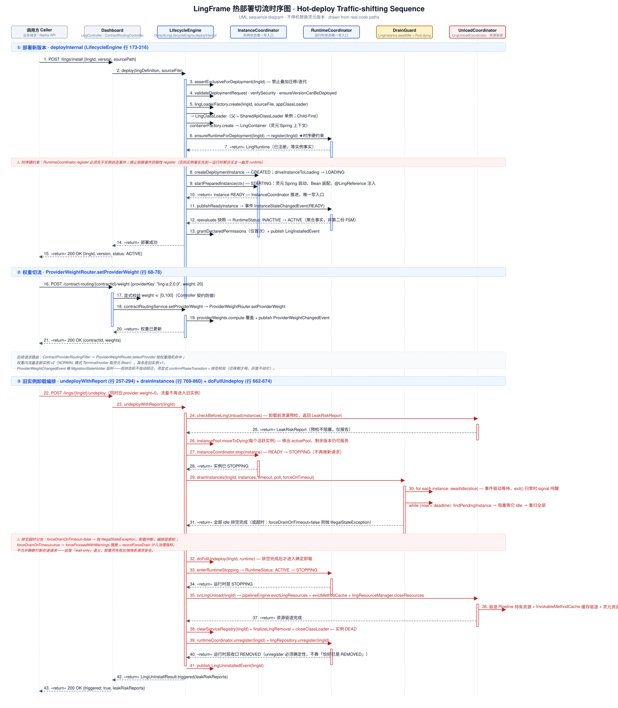

# 快速开始

这份文档是**正式入门文档**。

如果你只想先把示例跑起来，请优先看 [最短上手](quick-start.md)。
这份文档则负责在跑通之后，继续解释：

- 示例里到底启动了什么
- 为什么这些步骤成立
- 后续应该如何继续理解和使用 LingFrame

如果你只记住一句话，请记住：

> 灵珑让你在一个 JVM 进程里加载并治理彼此隔离的业务灵元，而不是一上来就把系统拆成微服务。

对当前公开实现来说，这不只是“把灵元加载起来”的演示，
也是你第一次接触一条可治理、可收敛、并且后续可继续验证规范热卸载的运行时链路。

---

## 环境要求

- **示例与主验证路径**：JDK 8 + Spring Boot 2.7（默认 Maven profile）
- **支持线**（可选）：JDK 17 + Spring Boot 3.x（`-Pspring-boot3`）
- Maven 3.8+

双栈结构（runtime 双 starter + dashboard 单 GAV 矩阵源码集）见 [生产配置清单](production-hardening.md) 第 6 节，细则见 [开发手册](development-manual.md) 第 5.2 节。

---

## 第一部分：5 分钟跑通

### 1. 克隆仓库

```bash
# GitHub
git clone https://github.com/LingFrame/LingFrame.git

# AtomGit
git clone https://atomgit.com/lingframe/LingFrame.git

# Gitee
git clone https://gitee.com/LingFrame/LingFrame.git
```

### 2. 构建项目

```bash
cd LingFrame
mvn clean install -DskipTests
```

### 3. 启动示例灵核应用

```bash
cd lingframe-examples/lingframe-example-lingcore-app
mvn spring-boot:run
```

### 4. 验证示例是否正常

```bash
curl http://localhost:8888/user-ling/user/listUsers
curl "http://localhost:8888/user-ling/user/queryUser?userId=1"
```

如果这两个请求都能正常返回，你已经拥有一个可运行的灵珑运行时。

---

## 第二部分：再多 5 分钟——验证当前已经闭环的治理能力

如果你想确认当前示例不只是"能跑"，而是真的已经具备控制面、观测和卸载闭环，可以继续做下面几步。

### 1. 打开 Dashboard

浏览器访问：

```text
http://localhost:8888/dashboard.html
```

你应该能看到当前已加载的灵元列表，以及健康指标、治理配置、时间线等控制面信息。

### 2. 查看当前灵元与版本

```bash
curl http://localhost:8888/lingframe/dashboard/lings
```

在默认示例里，通常能看到：

- `order-ling:1.0.0`
- `user-ling:1.0.0`
- `user-ling:1.1.0-canary`

### 3. 查看健康指标与治理指标

```bash
curl http://localhost:8888/lingframe/dashboard/lings/health/all
curl http://localhost:8888/lingframe/dashboard/lings/governance/all
```

这里可以直接看到：

- 灵元级 summary
- version 级明细
- 当前已采集到的治理信号

### 4. 对 `user-ling` 下发调用治理补丁

```bash
curl -X POST http://localhost:8888/lingframe/dashboard/governance/user-ling/invocation \
  -H "Content-Type: application/json" \
  -d "{\"timeoutMs\":3000,\"rateLimitPerSecond\":1,\"maxConcurrentThreads\":1}"
```

这一步对应当前已经闭环的调用治理参数：

- `timeoutMs`
- `rateLimitPerSecond`
- `maxConcurrentThreads`

### 5. 再次发起请求，并观察治理与观测是否变化

```bash
curl http://localhost:8888/user-ling/user/listUsers
curl http://localhost:8888/lingframe/dashboard/lings/health/all
curl http://localhost:8888/lingframe/dashboard/lings/governance/all
```

你应该能看到：

- 健康指标中的请求数、延迟、QPS 变化
- 治理指标中的限流/超时等信号变化

### 6. 验证结构化卸载预检

```bash
curl -X DELETE http://localhost:8888/lingframe/dashboard/lings/uninstall/user-ling/1.1.0-canary
```

这一步返回的已经不只是简单成功/失败，而是结构化卸载结果，包含：

- 是否真正触发卸载
- 总体风险级别
- 风险摘要列表

注意：

- 当前默认策略是"提示但不阻断"
- 所以即便预检返回风险提示，卸载主流程仍可能继续执行
- 卸载后的被动泄漏诊断链路仍然保留，并没有被卸载前预检替代

---

## 第三部分：从零开始——构建完整的灵珑应用

本节带你从零开始，完成一个完整的灵珑应用开发。

> ⚠️ **注意**：本教程基于当前实际代码结构编写。

### 目标

我们将构建一个简单的订单管理系统：

```
灵核（LingCore）
    │
    ├── user-ling（用户服务灵元）
    │   └── 提供用户查询能力
    │
    └── order-ling（订单服务灵元）
        ├── 依赖 user-ling 获取用户信息
        └── 提供订单创建、查询能力
```

### 3.1 环境准备

| 软件 | 版本 |
|------|------|
| JDK | **8**（示例默认）；支持线可选 17 + Boot 3 |
| Maven | 3.6+ |
| Spring Boot | **2.7.x**（示例默认，`spring-boot2-starter`）；支持线 3.x（`spring-boot3-starter`） |

下文 POM 示例走**主路径**：`lingframe-spring-boot2-starter` + Boot 2.7。若用 Boot 3 / JDK 17，改为 `lingframe-spring-boot3-starter` 与 Boot 3 BOM（本仓库对应 `-Pspring-boot3`）。

```bash
mkdir lingframe-demo
cd lingframe-demo

mkdir -p ling-core
mkdir -p shared-api
mkdir -p lings/user-ling
mkdir -p lings/order-ling
```

父 POM：

```xml
<!-- pom.xml -->
<project>
    <modelVersion>4.0.0</modelVersion>
    <groupId>com.example</groupId>
    <artifactId>lingframe-demo</artifactId>
    <version>1.0.0</version>
    <packaging>pom</packaging>

    <modules>
        <module>ling-core</module>
        <module>shared-api</module>
        <module>lings/user-ling</module>
        <module>lings/order-ling</module>
    </modules>

    <dependencyManagement>
        <dependencies>
            <dependency>
                <groupId>com.lingframe</groupId>
                <artifactId>lingframe-bom</artifactId>
                <version>${lingframe.version}</version>
                <type>pom</type>
                <scope>import</scope>
            </dependency>
        </dependencies>
    </dependencyManagement>
</project>
```

### 3.2 定义共享契约

> ⚠️ **重要**：Shared API 是灵核与灵元之间的进程级公共契约边界。跨边界使用的接口与 DTO 都应该放在这里。

```xml
<!-- shared-api/pom.xml -->
<project>
    <parent>
        <groupId>com.example</groupId>
        <artifactId>lingframe-demo</artifactId>
        <version>1.0.0</version>
    </parent>

    <artifactId>shared-api</artifactId>
    <packaging>jar</packaging>

    <dependencies>
        <dependency>
            <groupId>com.lingframe</groupId>
            <artifactId>lingframe-api</artifactId>
        </dependency>
    </dependencies>
</project>
```

定义用户查询服务接口：

```java
// shared-api/src/main/java/com/example/api/UserQueryService.java
package com.example.api;

import java.util.Optional;

public interface UserQueryService {
    
    Optional<UserDTO> findById(Long userId);
}
```

定义用户 DTO：

```java
// shared-api/src/main/java/com/example/api/UserDTO.java
package com.example.api;

import java.io.Serializable;

public class UserDTO implements Serializable {
    private Long id;
    private String userName;
    private String email;
    
    public UserDTO() {}
    
    public UserDTO(Long id, String userName, String email) {
        this.id = id;
        this.userName = userName;
        this.email = email;
    }
    
    public Long getId() { return id; }
    public void setId(Long id) { this.id = id; }
    public String getUserName() { return userName; }
    public void setUserName(String userName) { this.userName = userName; }
    public String getEmail() { return email; }
    public void setEmail(String email) { this.email = email; }
}
```

### 3.3 创建灵核应用

```xml
<!-- ling-core/pom.xml -->
<project>
    <parent>
        <groupId>com.example</groupId>
        <artifactId>lingframe-demo</artifactId>
        <version>1.0.0</version>
    </parent>

    <artifactId>ling-core</artifactId>
    <packaging>jar</packaging>

    <dependencies>
        <!-- LingFrame Spring Boot Starter（主路径：Boot 2.7 / JDK 8）。Boot 3 请改为 lingframe-spring-boot3-starter -->
        <dependency>
            <groupId>com.lingframe</groupId>
            <artifactId>lingframe-spring-boot2-starter</artifactId>
        </dependency>
        
        <!-- Dashboard（可选） -->
        <dependency>
            <groupId>com.lingframe</groupId>
            <artifactId>lingframe-dashboard</artifactId>
        </dependency>
        
        <!-- Shared API -->
        <dependency>
            <groupId>com.example</groupId>
            <artifactId>shared-api</artifactId>
            <version>${project.version}</version>
        </dependency>
        
        <!-- Spring Boot -->
        <dependency>
            <groupId>org.springframework.boot</groupId>
            <artifactId>spring-boot-starter-web</artifactId>
        </dependency>
        
        <!-- 数据库支持（示例需要） -->
        <dependency>
            <groupId>org.springframework.boot</groupId>
            <artifactId>spring-boot-starter-jdbc</artifactId>
        </dependency>
        <dependency>
            <groupId>com.h2database</groupId>
            <artifactId>h2</artifactId>
            <scope>runtime</scope>
        </dependency>
    </dependencies>

    <build>
        <plugins>
            <plugin>
                <groupId>org.springframework.boot</groupId>
                <artifactId>spring-boot-maven-plugin</artifactId>
            </plugin>
        </plugins>
    </build>
</project>
```

应用配置：

```yaml
# ling-core/src/main/resources/application.yaml
server:
  port: 8888

spring:
  datasource:
    driver-class-name: org.h2.Driver
    url: jdbc:h2:mem:lingframe;DB_CLOSE_DELAY=-1
    username: sa
    password:
  cache:
    type: simple

lingframe:
  enabled: true
  dev-mode: true
  
  # Shared API 预加载路径
  preload-api-jars:
    - ../shared-api
    
  # 灵元存放根目录
  ling-home: lings
  
  # 灵元额外目录（开发模式）
  ling-roots:
    - ../lings/user-ling
    - ../lings/order-ling
  
  # Dashboard 配置
  dashboard:
    enabled: true
    install-enabled: true

logging:
  level:
    com.lingframe: INFO
```

启动类：

```java
// ling-core/src/main/java/com/example/LingCoreApplication.java
package com.example;

import org.springframework.boot.SpringApplication;
import org.springframework.boot.autoconfigure.SpringBootApplication;

@SpringBootApplication
public class LingCoreApplication {
    public static void main(String[] args) {
        SpringApplication.run(LingCoreApplication.class, args);
    }
}
```

### 3.4 创建用户服务灵元

```xml
<!-- lings/user-ling/pom.xml -->
<project>
    <parent>
        <groupId>com.example</groupId>
        <artifactId>lingframe-demo</artifactId>
        <version>1.0.0</version>
    </parent>

    <artifactId>user-ling</artifactId>
    <packaging>jar</packaging>

    <dependencies>
        <!-- Shared API -->
        <dependency>
            <groupId>com.example</groupId>
            <artifactId>shared-api</artifactId>
            <version>${project.version}</version>
            <scope>provided</scope>
        </dependency>
        
        <!-- LingFrame API -->
        <dependency>
            <groupId>com.lingframe</groupId>
            <artifactId>lingframe-api</artifactId>
            <scope>provided</scope>
        </dependency>
        
        <!-- Spring Boot -->
        <dependency>
            <groupId>org.springframework.boot</groupId>
            <artifactId>spring-boot-starter</artifactId>
            <scope>provided</scope>
        </dependency>
        <dependency>
            <groupId>org.springframework.boot</groupId>
            <artifactId>spring-boot-starter-jdbc</artifactId>
            <scope>provided</scope>
        </dependency>
    </dependencies>
</project>
```

灵元清单：

> ⚠️ **注意**：`ling.yml` 使用驼峰命名法，如 `mainClass`、`accessType`。

```yaml
# lings/user-ling/src/main/resources/ling.yml
id: user-ling
version: 1.0.0
provider: "Example"
description: "用户服务灵元"
mainClass: "com.example.user.UserApplication"

governance:
  permissions: []
  
  # 灵元能力申请
  capabilities:
    - capability: "storage:sql"
      accessType: "WRITE"
    - capability: "cache:local"
      accessType: "WRITE"

properties:
  mark: "demo"
```

灵元入口类：

```java
// lings/user-ling/src/main/java/com/example/user/UserApplication.java
package com.example.user;

import org.springframework.boot.SpringApplication;
import org.springframework.boot.autoconfigure.SpringBootApplication;
import org.springframework.cache.annotation.EnableCaching;

@EnableCaching
@SpringBootApplication
public class UserApplication {
    public static void main(String[] args) {
        SpringApplication.run(UserApplication.class, args);
    }
}
```

服务接口定义：

```java
// lings/user-ling/src/main/java/com/example/user/service/UserService.java
package com.example.user.service;

import com.example.api.UserDTO;
import java.util.List;
import java.util.Optional;

public interface UserService {
    
    Optional<UserDTO> queryUser(String userId);
    
    List<UserDTO> listUsers();
    
    UserDTO createUser(String name, String email);
}
```

服务实现：

> ⚠️ **重要**：使用 `@LingService` 注解标记方法，声明这是一个对外暴露的能力。灵核将此注解作为 RPC 协议契约和路由分发的关键依据。

```java
// lings/user-ling/src/main/java/com/example/user/service/impl/UserServiceImpl.java
package com.example.user.service.impl;

import com.example.api.UserDTO;
import com.example.user.service.UserService;
import com.lingframe.api.annotation.Auditable;
import com.lingframe.api.annotation.LingService;
import com.lingframe.api.annotation.RequiresPermission;
import com.lingframe.api.security.Capabilities;
import lombok.RequiredArgsConstructor;
import lombok.extern.slf4j.Slf4j;
import org.springframework.cache.annotation.Cacheable;
import org.springframework.jdbc.core.BeanPropertyRowMapper;
import org.springframework.jdbc.core.JdbcTemplate;
import org.springframework.stereotype.Service;

import java.util.List;
import java.util.Optional;

@Slf4j
@Service
@RequiredArgsConstructor
public class UserServiceImpl implements UserService {

    private final JdbcTemplate jdbcTemplate;

    @LingService(id = "query_user", desc = "根据ID查询用户")
    @RequiresPermission(Capabilities.STORAGE_SQL)
    @Cacheable(value = "users", key = "#userId")
    @Override
    public Optional<UserDTO> queryUser(String userId) {
        log.info("queryUser, userId: {}", userId);
        String sql = "SELECT * FROM t_user WHERE id = ?";
        try {
            UserDTO user = jdbcTemplate.queryForObject(
                sql, 
                new BeanPropertyRowMapper<>(UserDTO.class), 
                userId
            );
            return Optional.ofNullable(user);
        } catch (Exception e) {
            return Optional.empty();
        }
    }

    @LingService(id = "list_users", desc = "列出所有用户")
    @RequiresPermission(Capabilities.STORAGE_SQL)
    @Auditable(action = "LIST_USERS", resource = "user")
    @Override
    public List<UserDTO> listUsers() {
        return jdbcTemplate.query(
            "SELECT * FROM t_user", 
            new BeanPropertyRowMapper<>(UserDTO.class)
        );
    }

    @LingService(id = "create_user", desc = "创建用户")
    @RequiresPermission(Capabilities.STORAGE_SQL)
    @Auditable(action = "CREATE_USER", resource = "user")
    @Override
    public UserDTO createUser(String name, String email) {
        jdbcTemplate.update(
            "INSERT INTO t_user (name, email) VALUES (?, ?)", 
            name, email
        );
        return new UserDTO(null, name, email);
    }
}
```

### 3.5 创建订单服务灵元（跨灵元调用）

灵元清单：

```yaml
# lings/order-ling/src/main/resources/ling.yml
id: order-ling
version: 1.0.0
provider: "Example"
description: "订单服务灵元"
mainClass: "com.example.order.OrderApplication"

governance:
  permissions: []
  
  capabilities:
    - capability: "storage:sql"
      accessType: "WRITE"
    - capability: "cache:local"
      accessType: "WRITE"
    - capability: "ipc:user-ling"
      accessType: "EXECUTE"
```

服务实现（跨灵元调用）：

> ⚠️ **重要**：使用 `@LingReference` 注入其他灵元提供的服务接口。框架会在所有已安装的灵元中查找实现了该接口的 Bean。

```java
// lings/order-ling/src/main/java/com/example/order/service/impl/OrderServiceImpl.java
package com.example.order.service.impl;

import com.example.api.UserDTO;
import com.example.api.UserQueryService;
import com.example.order.dto.OrderDTO;
import com.example.order.service.OrderService;
import com.lingframe.api.annotation.LingReference;
import com.lingframe.api.annotation.LingService;
import com.lingframe.api.annotation.RequiresPermission;
import com.lingframe.api.security.Capabilities;
import lombok.RequiredArgsConstructor;
import lombok.extern.slf4j.Slf4j;
import org.springframework.cache.annotation.Cacheable;
import org.springframework.jdbc.core.BeanPropertyRowMapper;
import org.springframework.jdbc.core.JdbcTemplate;
import org.springframework.stereotype.Service;

import java.util.Optional;

@Slf4j
@Service
@RequiredArgsConstructor
public class OrderServiceImpl implements OrderService {

    @LingReference
    private UserQueryService userQueryService;

    private final JdbcTemplate jdbcTemplate;

    @LingService(id = "get_order", desc = "根据ID查询订单")
    @RequiresPermission(Capabilities.STORAGE_SQL)
    @Override
    public OrderDTO getOrderById(Long orderId) {
        log.info("getOrderById, orderId: {}", orderId);
        try {
            OrderDTO order = jdbcTemplate.queryForObject(
                "SELECT * FROM t_order WHERE order_id = ?",
                new BeanPropertyRowMapper<>(OrderDTO.class),
                orderId
            );
            // 通过跨灵元调用获取用户信息
            if (order != null && order.getUserId() != null) {
                userQueryService.findById(order.getUserId()).ifPresent(
                    user -> order.setUserName(user.getUserName())
                );
            }
            return order;
        } catch (Exception e) {
            log.warn("Order not found: {}", orderId);
            return null;
        }
    }

    @LingService(id = "create_order", desc = "创建订单")
    @RequiresPermission(Capabilities.STORAGE_SQL)
    @Override
    public OrderDTO createOrder(Long userId, String productName) {
        log.info("createOrder, userId: {}, productName: {}", userId, productName);
        jdbcTemplate.update(
            "INSERT INTO t_order (user_id, product_name) VALUES (?, ?)", 
            userId, productName
        );
        OrderDTO order = new OrderDTO();
        order.setUserId(userId);
        order.setProductName(productName);
        return order;
    }
}
```

### 3.6 运行与测试

编译项目：

```bash
mvn clean package -DskipTests
```

启动灵核应用：

```bash
cd ling-core
mvn spring-boot:run
```

通过 Dashboard 管理灵元：

> Dashboard 是治理控制面，而不只是一个页面。

Dashboard 地址：`http://localhost:8888/dashboard.html`

**查看灵元列表**：

```bash
curl http://localhost:8888/lingframe/dashboard/lings
```

**激活灵元**：

```bash
curl -X POST http://localhost:8888/lingframe/dashboard/lings/user-ling/status \
  -H "Content-Type: application/json" \
  -d '{"status": "ACTIVE"}'

curl -X POST http://localhost:8888/lingframe/dashboard/lings/order-ling/status \
  -H "Content-Type: application/json" \
  -d '{"status": "ACTIVE"}'
```

**测试调用**：

```bash
# 创建用户
curl -X POST "http://localhost:8888/user-ling/user/createUser?name=张三&email=zhangsan@example.com"

# 查询用户
curl "http://localhost:8888/user-ling/user/queryUser?userId=1"

# 列出用户
curl http://localhost:8888/user-ling/user/listUsers
```

### 3.7 热更新演示

> ⚠️ 热更新仅在开发模式（`dev-mode: true`）下可用



> 热更新是「部署新版本 → 权重切流 → 旧实例排空卸载」全过程的一个触发点；上图展示了完整时序，本节只演示其中 reload 这一步。

修改 `UserServiceImpl`，添加日志或修改业务逻辑。

重新编译：

```bash
cd lings/user-ling
mvn clean package -DskipTests
```

热更新：

```bash
curl -X POST http://localhost:8888/lingframe/dashboard/lings/user-ling/reload
```

### 3.8 治理能力演示

灰度发布：

> 灰度是把一部分流量路由到指定灵元版本或实例——本质是按版本权重分流，`ProviderWeightRouter` N 元权重的特例（N=2）。

```bash
curl -X POST http://localhost:8888/lingframe/dashboard/contract-routing/user-ling/weight \
  -H "Content-Type: application/json" \
  -d '{"providerKey": "user-ling:1.1.0", "weight": 20}'
```

> `providerKey` 即路由键——灵元恒为 `lingId:version`（版本真源来自绑定实例上下文），灵核为裸 `lingcore-app`，写侧注册与路由读路径键化一致。`weight` 为 0-100 整数；Dashboard 下发后立即覆盖 `ProviderWeightRouter` 内的运行期权重，IPC 与 Web 治理链同时生效。

流量统计：

```bash
curl http://localhost:8888/lingframe/dashboard/lings/user-ling/stats
```

健康指标：

```bash
# 单个灵元健康指标
curl http://localhost:8888/lingframe/dashboard/lings/user-ling/health

# 所有灵元健康指标
curl http://localhost:8888/lingframe/dashboard/lings/health/all

# JVM 指标
curl http://localhost:8888/lingframe/dashboard/lings/metrics
```

### 3.9 关键差异——教程 vs 实际代码

本教程与当前实际代码的关键差异：

| 项目 | 教程示例 | 实际代码规范 |
|------|----------|--------------|
| ling.yml 主类字段 | `main-class` | `mainClass`（驼峰） |
| 灵元入口类 | 实现 `Ling` 接口 | `@SpringBootApplication` |
| 服务注册 | `@LingService(serviceId = "...")` | `@LingService(id = "...", desc = "...")` |
| 跨灵元调用 | `@LingReference(lingId = "...", serviceId = "...")` | `@LingReference`（自动匹配） |
| capabilities 格式 | `name` / `access-type` | `capability` / `accessType` |

---

## 第四部分：首轮接入策略

如果你不是来研究框架史，而是想判断"灵珑适不适合我当前系统"，这一节最合适。

这一节不讨论理想蓝图，只回答：

- 先用灵珑解决什么问题最值
- 第一轮接入该怎么走
- 当前代码已经做到哪一步

### 先用灵珑解决这些问题

当前最适合优先使用灵珑的场景，不是"我要做一整套平台"，而是下面这些现实问题：

- 系统已经长期运行，没人敢随便动
- 需要在不停机前提下逐步重建边界
- 想先把治理能力收进一条统一主链，而不是继续分散在各层
- 想让多版本并存、灰度、权限、审计和卸载都变得可解释

如果你的诉求只是：

- 做一个简单“插件框架”
- 快速拼一个前端扩展市场
- 立刻把单体改成分布式

那灵珑当前并不是最合适的工具。

### 推荐接入路径

**阶段 1：先选一个非核心灵元**

第一步不要上来就拆最核心的业务。

当前更稳妥的做法是：

- 选择边界相对清晰的业务能力
- 让它先变成一个灵元
- 先跑通安装、调用、治理、卸载和观测链

**阶段 2：先移动契约，再移动业务**

Shared API 当前仍然是强边界。

因此推荐顺序是：

1. 先定义 Shared API 契约
2. 再让业务灵元围绕契约实现
3. 避免把实现类塞进 Shared API

**阶段 3：先在 dev mode 下观察治理行为**

灵珑当前已经提供：

- Dashboard 控制面
- 指标与健康快照
- SSE 事件流
- 模拟测试

所以第一轮接入不应该只看"能不能跑"，而应该看：

- 生命周期是否收敛
- 权限与治理信号是否可见
- 卸载是否能进入规范链路

**阶段 4：灵元稳定后再引入多版本权重路由**

当前按版本权重分流（`ProviderWeightRouter` N 元权重，二元 N=2 即金丝雀特例）能力已经可用，但更适合在灵元本身稳定之后再引入。

推荐顺序：

1. 先单版本跑通
2. 再验证热重载 / 多版本共存
3. 最后再引入多版本权重路由（金丝雀即其 N=2 特例）

### 接入前只需要知道的三件技术事实

**1. 灵珑当前已经有统一治理主链**

当前不是每个入口各自做治理，而是尽量复用：

- `InvocationPipelineEngine`
- `FilterRegistry`

这意味着第一轮接入时，不要自己再旁路拼一套治理链。

**2. 灵珑当前已经有双层运行时状态模型**

状态已经收敛为：

- `InstanceStatus`
- `RuntimeStatus`

所以第一轮接入时，不要再把运行时状态散回聚合对象或业务对象。

**3. 灵珑当前已经把规范热卸载当成正式能力推进**

当前代码不只是能加载灵元，也已经正式包含：

- 排空
- teardown
- 资源驱逐
- 泄漏检测

所以第一轮接入设计时，必须从一开始就把"将来怎么卸载"考虑进去。

### 一套稳妥的首轮上线检查单

如果你想让第一轮接入更稳，至少确认：

1. Shared API 契约是否稳定
2. 灵元是否只依赖 `lingframe-api`
3. 调用是否走统一治理主链
4. Dashboard 是否能看到状态、指标和时间线
5. 卸载链路是否至少能跑通到预检与 teardown

### 新手最容易踩的坑

**把 Shared API 当成共享实现层**

这是最常见的边界退化方式。

Shared API 当前应该只放：

- 接口
- DTO
- 必要注解

而不应该塞实现逻辑。

**只验证加载，不验证卸载**

如果只证明"能装进去"，而没有验证"怎么卸下来"，那对长期运行系统帮助有限。

**绕开统一治理主链**

如果 Web、Bean、灵元调用各走一套治理逻辑，后面一定会重新分裂。

### 当前阶段最现实的使用方式

当前最现实的方式不是"把系统一次性灵珑化"，而是：

> 先选一个可控边界，先把运行时秩序、控制面和卸载链路建立起来，再逐步扩展范围。

---

## 这次跑通已经证明了什么

当示例成功跑起来时，你其实已经验证了四件事：

- 灵核可以在单进程里发现并加载灵元
- 共享契约会在灵元启动前先 preload
- 跨灵元调用不会绕过治理内核
- 当前示例配置已经足够继续阅读开发文档

如果你继续完成上面的 Dashboard / 治理 / 卸载验证，你还会额外看到：

- 控制面可以热调调用治理参数
- 健康指标与治理指标会在真实请求后变化
- 卸载前预检、真实卸载与卸载后诊断已经形成一条主链

下一步最值得继续验证的，不只是"还能不能再加载一个灵元"，
而是这条运行时链路在 reload / unload / cleanup 场景下能否继续保持有序。

接下来如果你想直接开始写灵元，去 [业务灵元开发指南](ling-development.md)。
示例总览：[lingframe-examples/README.md](../../lingframe-examples/README.md)（入门用法与单体改造独立项目 LingFrame-RuoYi 指引）。
配置对照可看 [生产硬化配置清单](production-hardening.md)。
