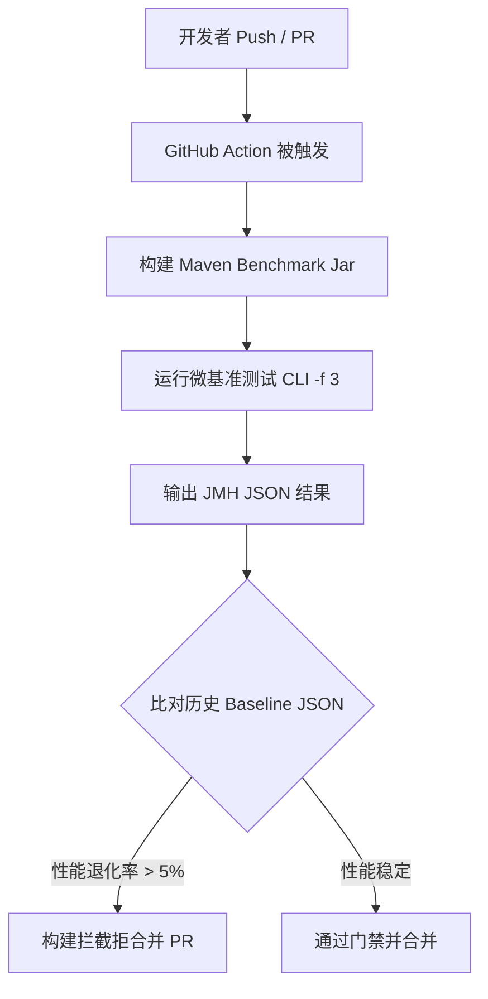

# 灵珑（LingFrame）基准测试套件指南

本模块包含对灵珑运行时的核心组件（状态机、ClassLoader、容器仓储、调用流水线、事件总线、生命周期引擎）的生产级微基准性能测试（Micro-benchmarks），使用主流的 **JMH (Java Microbenchmark Harness)** 框架构建。

---

## 1. 核心设计与工作流规范

### 1.1 开发工作流 (IDE vs 命令行)
为了保证开发敏捷性与基准数据的可信度，本测试套件采用**分级运行策略**：
* **本地快速验证 (IDE)**：代码中所有 Benchmark 类的 `@Fork` 注解均硬编码声明为 `@Fork(1)`。开发人员可以在 IntelliJ IDEA 或 Eclipse 中直接运行单个测试方法，进行极速的热点排查和逻辑验证。
* **正式基准评估 (CLI)**：在正式发布、性能比对或生成合规报告时，**严禁使用 `@Fork(1)`**。必须使用命令行并通过 `-f 3` 显式覆盖，以保证统计学的置信区间：
  ```bash
  # 运行所有基准测试并 Fork 3 次进行精确统计
  java -jar target/lingframe-benchmarks.jar -f 3
  ```

### 1.2 JIT 编译器 dontinline 入口级精细化收窄
为了防止 JVM 运行时将整个测试逻辑（包括 Pipeline 过滤链、事件订阅等）过于理想化地合并内联，从而失真测得优于生产环境的数据，我们对以下两个核心入口函数进行了 **JIT dontinline 强行阻断**：
* `com.lingframe.core.pipeline.InvocationPipelineEngine.invoke`
* `com.lingframe.core.event.EventBus.publish`

其余所有的辅助和组件方法均保持 JIT 默认内联优化，完全对标并模拟生产环境的实际装配。

---

## 2. 编译与运行指南

### 2.1 完整打包构建
JMH 运行要求将所有基准测试及依赖 shaded 进一个独立的 Fat JAR。请在项目根目录下执行：
```bash
mvn clean package -Pbenchmark -am -DskipTests
```
构建成功后，会在 `lingframe-benchmark/target/` 目录下生成 `lingframe-benchmarks.jar`。

### 2.2 运行指定基准测试
```bash
# 运行稳态端到端测试 (Fork 3次，预热 3 轮，运行 5 轮)
java -jar lingframe-benchmark/target/lingframe-benchmarks.jar EndToEndBenchmark -f 3

# 运行状态机并发测试
java -jar lingframe-benchmark/target/lingframe-benchmarks.jar StateMachineConcurrentBenchmark -f 3

# 运行 ClassLoader 基准测试，并附加 GC 监控 profile
java -jar lingframe-benchmark/target/lingframe-benchmarks.jar ClassLoaderBenchmark -f 3 -prof gc
```

---

## 3. JVM 热点分析与火焰图生成 (-prof async)

为了对关键调用进行 CPU 栈帧剖析和锁争用定位，本测试套件完美契合了 **async-profiler**。

### 3.1 环境准备
1. 下载适合您平台的 `async-profiler` 动态库。
2. 确保 `libasyncProfiler.so` (Linux) 或 `asyncProfiler.dll` (Windows) 已放置在系统路径或通过 JVM 参数指定。

### 3.2 运行 CPU 采样并输出火焰图
```bash
# 运行端到端测试，同时采集 CPU 采样数据，输出为 SVG 火焰图
java -jar lingframe-benchmark/target/lingframe-benchmarks.jar EndToEndBenchmark \
  -f 1 -prof async:output=flamegraph;dir=target/profiler;event=cpu
```
运行结束后，在 `target/profiler/` 目录中即可找到生成的 `flamegraph.svg`，用浏览器打开即可分析 CPU 热点路径。

### 3.3 运行锁争用采样 (Lock Profiling)
若想深入研究多线程并发下的线程同步锁或轻量级锁开销，可指定 `event=lock`：
```bash
java -jar lingframe-benchmark/target/lingframe-benchmarks.jar StateMachineConcurrentBenchmark \
  -f 1 -prof async:output=flamegraph;dir=target/profiler;event=lock
```

---

## 4. CI/CD 性能门禁规划 (第三阶段)

为了防止性能随版本迭代出现渐进式退化，规划在第三阶段将基准测试融入 CI/CD 流水线中，建立起自动化性能门禁：



### 自动化基准卡点设置
1. **历史基线存储**：将主干分支的最新基准性能数据（JSON）托管至远端 S3 存储或专门的基准数据库中。
2. **退化检测脚本**：在 GHA 流水线中，通过 `jmh-compare` 工具或自研 Python 脚本自动读取当前 PR 产出的 `result.json` 和 `baseline.json` 进行横向比对。
3. **卡点策略**：若检测到 `happyPathPipeline` 或 `steadyStateInvoke` 的单次调用平均时延退化超过 5%，或者 `StateMachine` CAS 并发吞吐下降 10%，则自动打回 PR 并发出 Slack/钉钉警告。
